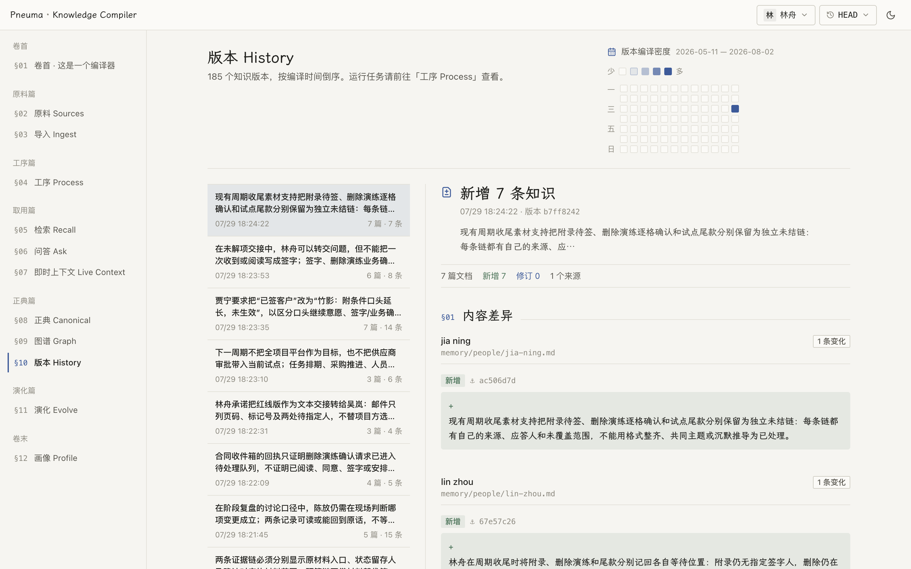

# Pneuma Knowledge Compiler

**English** | [简体中文](README.zh-CN.md)

Compile the raw material of your domain — meetings, documents, chat, email — into an evolvable knowledge base with explicit provenance.

### Domain-oriented modeling

Different domains carry different concepts and different usage; their knowledge bases should not be built the same way. What gets recorded, and in what structure, is defined by a compile contract you write. The framework provides only the domain-agnostic substrate: indexing, retrieval, and enforcement.

### An evolvable model

No business stands still. Any model fixed up front degrades as data accumulates, distributions shift, and the business pivots. The framework ships evolution as infrastructure — proposals mined from compile history, diff review, data migration — and the business drives model iteration at its own pace.

### Provenance enforced by the framework

Authored ledger claims must have a provenance chain reaching a source or an already admitted mechanical record; this applies to unchanged claims too. Source-free cycles do not qualify. The framework checks citation syntax and source bounds, and every declared reference in every existing overview. Mechanical archive records and volume catalogs retain their own narrow admission rules. These checks establish traceable addresses, not faithful interpretation: semantic fidelity still depends on the compile contract, model and review.

### What this is not

> This is not an agent memory system. A knowledge base and a memory are two different things. What an agent should remember is that it **has** a knowledge base — its construction philosophy, a top-level overview, how to query it, how to maintain it — not the knowledge base itself as memory.

<picture>
  <source media="(prefers-color-scheme: dark)" srcset="docs/assets/history-dark.png">
  
</picture>

## See it in three minutes

No API key, no questions asked. One command generates a real project that already has a compiled library (191 synthetic sources, 1,188 claims), starts it, and tells you where to look:

```bash
cd scaffold && ./init.py --demo      # lands in a fresh temp directory; --target DIR to choose
```

It prints a `http://127.0.0.1:<port>` address. Walk the whole pipeline in the browser: sources, compile history, the canonical library with per-claim citations and a closed volume, the retrieval surfaces, and the Engine Console — where you change a strategy knob, read its stated blast radius, and apply it as a version. Asking questions needs an OpenRouter key; everything above doesn't.

The library it ships is [`examples/opc`](examples/opc/README.md) — an agent-built example you can also run in place (`cd examples/opc && ./demo.sh`).

## Build one from your own data

`scaffold/` is a project generator — an interactive guided setup (or a single command with an answers file) that produces a complete knowledge-base project in a directory of your choosing, middleware ports auto-probed and collision-free:

```bash
cd scaffold && ./init.py     # interactive: empty project and executable starter contract by default
cd ~/my-kb && ./start.sh     # stack, ingest, compile, cited demo answers — one command
```

Then make it yours: feed your `.md` material to `./app.py ingest <dir>`, edit `engine/compile/contract.md` (what deserves to be recorded) and `engine/persona/profile.yaml` (whose library this is), recompile and review.

Prefer to be guided? Hand `scaffold/AGENT-GUIDE.md` to your coding agent and it will walk you through building a library from your own data, step by step.

## How it works

Source material is kept verbatim and stays reachable at four levels: L0 raw fetch, L1 lexical search, L2 semantic search, L3 canonical knowledge. Only two things are authoritative — the raw sources, and the canonical library: a per-user Git repository where every compile is a commit and every piece of knowledge carries its citations. Beside them sits a third kind of persistent thing, the kept record — a chunk manifest, a compile event, the record of one answering call — a stored observation that a rebuild replays and never rewrites. Everything else (indexes, projections) is derived and rebuildable from the substrate it declares. Your compile contract decides what becomes canonical; a mechanical gate verifies every citation at write time and rejects whatever cannot be resolved back to the source.

Native media starts deliberately narrow and complete: IM messages may carry JPEG, PNG, WebP or GIF originals. They live in private S3-compatible L0 storage (RustFS locally), reach the compile model either as labelled caption/OCR or real image blocks, resolve through the message's ordinary block citation, and render in both source readers and citation views. Other media types are not yet declared as supported.

## How evolution happens

The compiler records what happened during each compile. From that history the framework drafts schema changes on a branch — new document families, revised path templates, restructured pages — and puts the diff in front of you. Adopt, and a mechanical reconciliation merges it; drop, and nothing changed. A contract change alone does not rewrite old claims. Adopting a restructuring can change canonical knowledge, so review its proposed meaning as well as its mechanical validity.

## Repository layout

```
packages/pneuma-knowledge-core        # domain logic + async ports (pydantic + langchain only)
packages/pneuma-knowledge-service     # FastAPI service, adapters (Postgres/Qdrant/Meilisearch/S3/Git), workers
packages/pneuma-knowledge-strategies  # reference compile contracts (data package; never imported by the framework)
packages/pneuma-knowledge-eval        # judgement-quality metrics
apps/web                              # bilingual web UI
scaffold/                             # copy-out application template for your own knowledge base
examples/                             # opc: a complete agent-built example project with a prebuilt library
infra/                                # local dev stack (Postgres, Qdrant, Meilisearch, RustFS)
```


## Acknowledgements

The web reading face embeds LXGW WenKai Screen (OFL 1.1). Its typography discipline borrows from [kami](https://github.com/tw93/kami) — whose default Chinese face (TsangerJinKai 02) is free for personal use only, which is why this project ships an OFL face instead. Semantic chunking's boundary-detection philosophy is inspired by [nemori](https://github.com/nemori-ai/nemori).

## License

[MIT](LICENSE)
