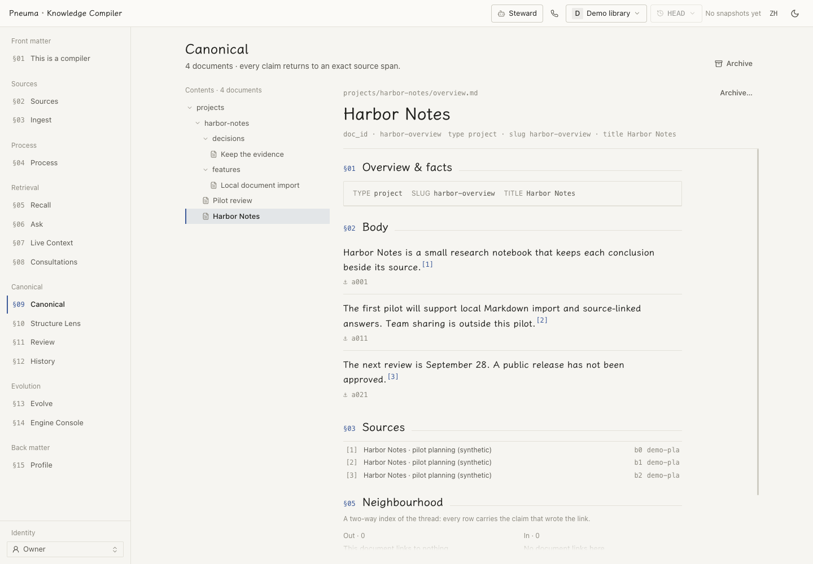

# Pneuma Knowledge Compiler

**English** | [简体中文](README.zh-CN.md)

Turn meetings, documents, messages, email and coding-agent sessions into a maintained knowledge library, with claims linked to their original source passages.

A **compile contract** defines what your domain records and how its pages are organized. The framework preserves sources, checks provenance at the write boundary, versions the library in Git, and rebuilds its search indexes. Citation checks establish traceability; they do not prove that a model interpreted the evidence correctly.

<picture>
  <source media="(prefers-color-scheme: dark)" srcset="docs/assets/library-en-dark.png">
  
</picture>

*Current UI with entirely synthetic documentation fixtures. No personal library or live account was used. [Screenshot provenance and reproduction](docs/assets/README.md).*

## Choose a starting point

| What you want | Start here |
|---|---|
| A personal library, project-session sync and a desktop tray | [Personal edition](personal/README.md) |
| A standalone project with your own data and compile contract | [Project generator](scaffold/README.md) |
| A compiled example to browse without an API key | The synthetic demo below |
| To integrate or develop the framework | [Architecture](docs/architecture.md), [API](docs/reference/http-api.md), [contributing](CONTRIBUTING.md) |

## Try the synthetic demo

With Python 3.12+, `uv` and Docker available, run from this checkout:

```bash
cd scaffold && ./init.py --demo      # fresh temporary project; use --target DIR to choose
```

The command restores a prebuilt library and prints its local browser address. Browse sources, canonical pages, citations, compile history and the Engine Console without a model key. The first container build can take several minutes. Model-backed questions need provider credentials; the demo's deterministic vectors are for browsing, not a semantic-retrieval quality benchmark.

The reference library is [`examples/opc`](examples/opc/README.md), built from synthetic material. Its build record and evaluation results remain with the example. Run `cd examples/opc && ./demo.sh` for its interactive menu.

## What you can do

- **Compile and inspect.** Follow each claim to an exact source span; inspect Git history and per-claim changes. Overview heads summarize subjects while the ledger preserves their history.
- **Ask or talk.** Use ranked retrieval, fast answers, deep investigation, briefing Q&A or Live Context. The Steward view offers coding-agent chat and, when configured, a separate voice call to the library. [Voice behavior and requirements](docs/design/voice-call.md).
- **Keep project knowledge current.** The personal edition imports eligible Codex and Claude Code sessions from the projects you choose. The tray reports sync, queue and service health. [Personal edition](personal/README.md).
- **Review the library's shape.** The Structure Lens reads six structural dimensions; Review lists page-level findings and can hand repairs to a Steward round. These are diagnostics, not a factual-accuracy score. [Structure Lens](docs/design/structure-lens.md).
- **Change the model deliberately.** Review proposed schema evolution before adoption. Archive subjects through an explicit proposal while preserving their history and an explanatory live record. [Evolution](docs/guides/evolution.md) · [archive](docs/design/archive.md).

## Build with your own material

```bash
cd scaffold && ./init.py            # interactive setup; empty project by default
cd ~/my-kb && ./start.sh             # use the directory selected during setup
./app.py glance
./app.py ask "What is still undecided?" --sources
```

The generator probes free middleware ports and creates the runtime, configuration and a usable starter contract. Put modeling decisions in `engine/compile/contract.md`; optional owner information belongs in `engine/persona/profile.yaml`. Credentials stay in the project's ignored `.env`. Contract changes govern future compiles; they do not rewrite existing knowledge.

For guided setup, give your coding agent [scaffold/AGENT-GUIDE.md](scaffold/AGENT-GUIDE.md). For personal libraries managed together on one machine, use [personal/README.md](personal/README.md) instead.

## How it works

The same material has four parallel access levels: **L0** verbatim fetch, **L1** lexical search, **L2** semantic retrieval, and **L3** canonical claims. L0 and L1 remain reachable regardless of compilation choices.

Two things are authoritative: raw sources and each user's canonical Git library. Kept records—chunk manifests, compile events and consultations—preserve observations and are replayed, not rewritten, during rebuilds. Search indexes and other projections are derived from their declared substrates. A derived rebuild changes neither the sources nor canonical knowledge.

The input boundary has six provider-neutral contracts: `meeting/v1`, `document-library/v1`, `im/v1`, `email/v1`, `owner-dialogue/v1` and `agent-session/v1`. IM sources can also carry JPEG, PNG, WebP or GIF originals with block-level citations. [Source contracts](docs/reference/source-contracts.md).

This is a knowledge-base framework, not an agent memory system. An agent can remember where its library is and how to use it; the library remains the place to retrieve and maintain the knowledge itself.

## Repository map

| Path | Purpose |
|---|---|
| `packages/pneuma-knowledge-core` | Domain logic and async ports, without middleware clients |
| `packages/pneuma-knowledge-service` | FastAPI, adapters, workers, coding-agent CLI and voice integration |
| `packages/pneuma-knowledge-strategies` | Reference compile contracts; the framework never imports this data package |
| `packages/pneuma-knowledge-eval` | Read-only judgment-quality metrics |
| `apps/web` | Bilingual console |
| `personal` | Standalone personal edition, `pkchome` and optional desktop tray |
| `scaffold` | Standalone project generator and agent setup guide |
| `examples/opc` | Synthetic reference project, prebuilt library and build/evaluation record |
| `infra` | Local development middleware |

[Documentation index](docs/README.md) · [Development setup](docs/reference/deployment.md) · [Contribution rules](CONTRIBUTING.md)

## Acknowledgements

The reading interface embeds LXGW WenKai Screen (OFL 1.1). Its typography discipline borrows from [kami](https://github.com/tw93/kami). Semantic chunking's boundary-detection philosophy is inspired by [nemori](https://github.com/nemori-ai/nemori).

## License

[MIT](LICENSE)
