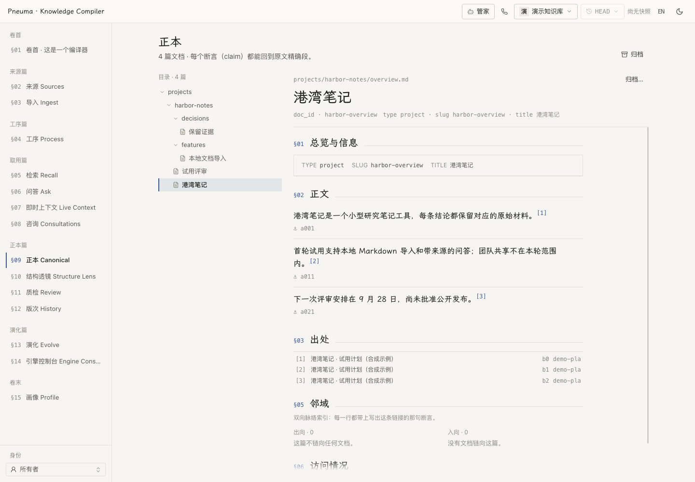

# Pneuma Knowledge Compiler

[English](README.md) | **简体中文**

把会议、文档、聊天、邮件和 coding-agent 会话整理成持续维护的知识库，让每条主张都能回到原始材料。

**编译契约**定义一个领域记什么、页面怎样组织。框架保留原文，在写入边界检查溯源，用 Git 记录知识库版本，并支持重建搜索索引。引用校验保证的是可追溯性，不证明模型对证据的解读一定正确。

<picture>
  <source media="(prefers-color-scheme: dark)" srcset="docs/assets/library-zh-dark.png">
  
</picture>

*截图使用当前 UI 和完全合成的文档示例，没有打开个人知识库或真实账号。[截图来源与复现方法](docs/assets/README.zh-CN.md)。*

## 从哪里开始

| 你想做什么 | 入口 |
|---|---|
| 管理个人知识库、同步项目会话、使用桌面托盘 | [个人版](personal/README.zh-CN.md) |
| 用自己的数据和编译契约生成独立项目 | [项目生成器](scaffold/README.zh-CN.md) |
| 不用 API key 浏览一座已经编好的示例库 | 下方的合成演示 |
| 集成或开发框架 | [架构](docs/architecture.zh-CN.md)、[API](docs/reference/http-api.zh-CN.md)、[贡献指南](CONTRIBUTING.zh-CN.md) |

## 体验合成演示

准备好 Python 3.12+、`uv` 和 Docker，在此仓库运行：

```bash
cd scaffold && ./init.py --demo      # 新建临时项目；用 --target DIR 指定目录
```

命令恢复预编译知识库，并打印本地浏览器地址。浏览原始材料、正本页面、引用、编译历史和引擎控制台不需要模型 key。首次构建容器可能需要几分钟。模型问答需要相应凭据；演示使用的确定性向量用于浏览，不代表语义检索质量。

参考库位于 [`examples/opc`](examples/opc/README.zh-CN.md)，材料全部合成，构建记录和评测结果随示例保留。运行 `cd examples/opc && ./demo.sh` 可打开它的交互菜单。

## 现在能做什么

- **编译并核对证据。** 从每条主张回到原文段落，查看 Git 历史与逐条修改。概览描述主题的当前面貌，账本保留历史。
- **提问或通话。** 使用检索、快速问答、深度调查、简报问答或 Live Context。Steward 页面提供 coding-agent 对话，并可在配置后单独发起知识库语音通话。[语音行为与要求](docs/design/voice-call.zh-CN.md)。
- **持续整理项目知识。** 个人版按你选择的项目范围导入符合条件的 Codex、Claude Code 会话；托盘显示同步、队列和服务状态。[个人版](personal/README.zh-CN.md)。
- **检查知识库结构。** Structure Lens 从六个维度观察结构，Review 列出页面级问题，并可交给 Steward 修整。它们是诊断工具，不是事实准确率评分。[结构透镜](docs/design/structure-lens.zh-CN.md)。
- **有依据地调整模型。** 先审阅演进提案，再采纳结构变化；通过明确的提案归档主题，同时保留历史和仍可检索的说明记录。[演进](docs/guides/evolution.zh-CN.md) · [归档](docs/design/archive.zh-CN.md)。

## 使用自己的材料

```bash
cd scaffold && ./init.py            # 交互设置；默认建立空项目
cd ~/my-kb && ./start.sh             # 换成设置时选择的目录
./app.py glance
./app.py ask "哪些事情还没有决定？" --sources
```

生成器探测空闲中间件端口，创建运行文件、配置和可用的起始契约。建模判断写入 `engine/compile/contract.md`；可选的个人信息放在 `engine/persona/profile.yaml`。凭据留在项目忽略的 `.env` 中。修改契约影响未来编译，不重写已有知识。

需要引导时，把 [scaffold/AGENT-GUIDE.zh-CN.md](scaffold/AGENT-GUIDE.zh-CN.md) 交给 coding agent。如果要在一台机器上统一管理多个个人库，使用[个人版入口](personal/README.zh-CN.md)。

## 工作方式

同一份材料有四个并行访问层：**L0** 原文直取、**L1** 词法搜索、**L2** 语义检索、**L3** 正本主张。无论是否编译，L0 和 L1 都保持可达。

权威只有两样：原始来源和每用户的正本 Git 仓库。分块清单、编译事件、咨询记录属于被保留的观察，重建时只重放、不改写。搜索索引和其他投影从各自声明的底层材料派生；重建派生层不改变原始来源或正本知识。

输入边界有六种与供应商无关的契约：`meeting/v1`、`document-library/v1`、`im/v1`、`email/v1`、`owner-dialogue/v1`、`agent-session/v1`。IM 来源还可携带 JPEG、PNG、WebP 或 GIF 原图，并通过原有块级引用追溯。[来源契约](docs/reference/source-contracts.zh-CN.md)。

这是知识库框架，不是 Agent 记忆系统。Agent 可以记住知识库在哪里、如何使用；知识本身仍通过知识库检索和维护。

## 仓库地图

| 路径 | 用途 |
|---|---|
| `packages/pneuma-knowledge-core` | 领域逻辑和异步端口，不依赖中间件客户端 |
| `packages/pneuma-knowledge-service` | FastAPI、适配器、worker、coding-agent CLI 和语音接入 |
| `packages/pneuma-knowledge-strategies` | 参考编译契约；框架不导入这个数据包 |
| `packages/pneuma-knowledge-eval` | 只读的判断质量度量 |
| `apps/web` | 双语控制台 |
| `personal` | 独立个人版、`pkchome` 和可选桌面托盘 |
| `scaffold` | 独立项目生成器及 agent 建库指南 |
| `examples/opc` | 合成参考项目、预编译库、构建和评测记录 |
| `infra` | 本地开发中间件 |

[文档索引](docs/README.zh-CN.md) · [开发环境](docs/reference/deployment.zh-CN.md) · [贡献规范](CONTRIBUTING.zh-CN.md)

## 致谢

阅读界面内嵌霞鹜文楷屏幕阅读版（OFL 1.1）。排版纪律借鉴 [kami](https://github.com/tw93/kami)，语义分块的边界检测哲学受 [nemori](https://github.com/nemori-ai/nemori) 启发。

## 许可证

[MIT](LICENSE)
