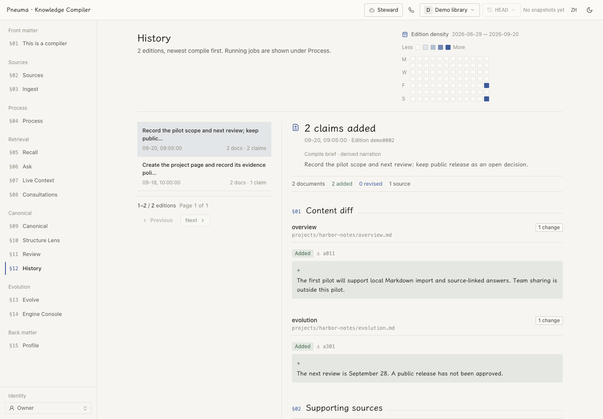

# Web workbench

**English** | [简体中文](README.zh-CN.md)

The bilingual browser interface for reading sources and cited canonical pages, inspecting compilation, asking the library, and working with its Steward. English/Chinese and light/dark themes are built in.

## Run and check

Set up the API, worker and middleware using the [deployment guide](../../docs/reference/deployment.md). In `apps/web`:

```bash
pnpm install
VITE_ENGINE_FIXTURES=false pnpm dev  # :5173; API proxy defaults to :18000
pnpm run build                     # tsc -b && vite build
pnpm test                          # node --test tests/*.test.mjs
```

| Variable | Behavior |
|---|---|
| `VITE_API_BASE` | Empty means same-origin; development requests use the Vite proxy. |
| `PNEUMA_KNOWLEDGE_API_PORT` | Vite's backend proxy port, default `18000`. |
| `VITE_ENGINE_FIXTURES` | Set exactly `false` for the real Engine Console API. Otherwise that view uses bundled, mutable fixtures; this does **not** mock other views. |

Vite variables are baked into production builds. For a packaged synthetic demo, see [OPC](../../examples/opc/). For other installation options, see the [project README](../../README.md).

## What is available

Navigation depends on the Owner/Visitor lens and deployment. The personal edition also supplies home and library selection.

| Surface | Purpose |
|---|---|
| Sources and ingest | Browse verbatim material and preview imports before writing. |
| Process and history | Inspect queue states, retry waits, commits and per-claim changes. |
| Library | Read canonical documents, claim anchors, source references and related pages. |
| Recall, briefings and Live Context | Search through rag/fast/deep lanes, ask questions and follow a live context stream. |
| Consultations | Inspect recorded questions, delivered evidence and answers. |
| Structure Lens and review | Inspect six structural dimensions and page-level findings; hand repairs to the Steward. |
| Evolution | Review proposed contract/library changes before adoption. |
| Engine Console | Inspect configuration, edit versioned engine files and review changes before applying. |
| Profile and overview | View declared owner information and the system's current counts. |

<picture>
  <source media="(prefers-color-scheme: dark)" srcset="../../docs/assets/history-en-dark.png">
  
</picture>

*Current UI with entirely synthetic sources and history. [Screenshot data and reproduction](../../docs/assets/README.md).*

**Steward**, available to the Owner from the shell, streams the coding agent's replies and activity. Its composer accepts pasted, dropped or attached images (PNG/JPEG/WebP/GIF, up to four per message and 5 MiB each). The **Call the library** entry starts a separate voice session when the deployment has the required credentials and API recall model. Opening the view does not start a call. See [voice design](../../docs/design/voice-call.md).

## Implementation and design

React 18, Zustand, Radix and Tailwind 4. `src/App.tsx` maps view names to lazy components; the store synchronizes selections with `location.hash`, so deep links and browser history work without react-router. The shell carries library/tenant selection, snapshots, locale, theme and the Steward entry. A frozen snapshot is marked read-only.

Personal-tray links pass `?locale=zh|en&theme=light|dark`. `src/lib/handoff.ts` validates and stores these preferences, then removes the parameters from the address.

The design authority is [DESIGN.md](DESIGN.md). Colors live in [tokens.css](src/styles/tokens.css); reading typography and scroll conventions live in [index.css](src/index.css). Light “Paper” and dark “Lightbox” are independently tuned, with one blue accent, restrained motion and serif reading text. The `#/components` gallery exposes the primitives under `src/ui/`; check it before adding one.
