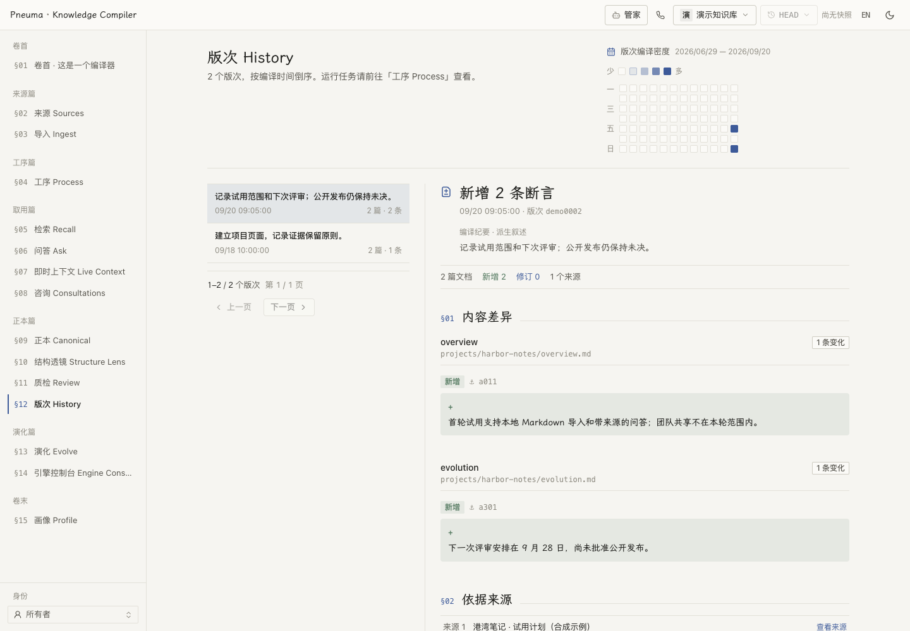

# Web 工作台

[English](README.md) | **简体中文**

双语浏览器界面：阅读来源与带引用的正本页面，检查编译过程，向知识库提问，与 Steward 协作。内置中英文及明暗主题。

## 运行与检查

按[部署指南](../../docs/reference/deployment.zh-CN.md)配置 API、worker 和中间件。在 `apps/web` 中运行：

```bash
pnpm install
VITE_ENGINE_FIXTURES=false pnpm dev  # :5173；API 代理默认指向 :18000
pnpm run build                     # tsc -b && vite build
pnpm test                          # node --test tests/*.test.mjs
```

| 变量 | 行为 |
|---|---|
| `VITE_API_BASE` | 留空表示同源；开发请求走 Vite 代理。 |
| `PNEUMA_KNOWLEDGE_API_PORT` | Vite 后端代理端口，默认 `18000`。 |
| `VITE_ENGINE_FIXTURES` | 必须设为 `false` 才连接真实引擎控制台 API。否则该视图使用内置可变 fixture；它**不会**模拟其他视图。 |

Vite 变量在生产构建时写入产物。完整打包的合成演示见 [OPC](../../examples/opc/)，其他安装方式见[项目 README](../../README.zh-CN.md)。

## 功能入口

导航随 Owner/Visitor 视角与部署而变。个人版还提供首页和知识库选择。

| 界面 | 用途 |
|---|---|
| 来源与导入 | 浏览原文，写入前预览导入结果。 |
| 工序与历史 | 检查队列状态、重试等待、提交及逐条主张变化。 |
| 文库 | 阅读正本文档、主张锚点、来源引用与关联页面。 |
| 检索、简报与实时上下文 | 通过 rag/fast/deep 检索、提问，跟随实时上下文流。 |
| 咨询记录 | 检查留存的问题、交付的证据与答案。 |
| 结构透镜与质检 | 查看六个结构维度和页面级发现，将修复交给 Steward。 |
| 演进 | 采纳前审阅契约与文库变更提案。 |
| 引擎控制台 | 检查配置、编辑版本化引擎文件，应用前审阅变更。 |
| 档案与概览 | 查看已声明的拥有者信息与当前系统计数。 |

<picture>
  <source media="(prefers-color-scheme: dark)" srcset="../../docs/assets/history-zh-dark.png">
  
</picture>

*当前界面，来源与历史全部为合成数据。[截图数据与复现方式](../../docs/assets/README.zh-CN.md)。*

Owner 可从外壳进入 **Steward**，查看编码代理流式回复与活动。输入框接受粘贴、拖入或附加图片（PNG/JPEG/WebP/GIF，每条最多四张，每张不超过 5 MiB）。部署配好所需密钥与 API 召回模型后，可用**呼叫知识库**入口开启独立语音会话。仅打开视图不会开始通话。见[语音设计](../../docs/design/voice-call.zh-CN.md)。

## 实现与设计

React 18、Zustand、Radix、Tailwind 4。`src/App.tsx` 将视图名映射到懒加载组件；store 把选择同步到 `location.hash`，无需 react-router 即支持深链和浏览器历史。外壳提供知识库/租户选择、快照、语言、主题及 Steward 入口；冻结快照标明只读。

个人版托盘链接携带 `?locale=zh|en&theme=light|dark`。`src/lib/handoff.ts` 验证并保存偏好，随后从地址移除参数。

设计权威是 [DESIGN.zh-CN.md](DESIGN.zh-CN.md)。颜色放在 [tokens.css](src/styles/tokens.css)，阅读排版与滚动约定放在 [index.css](src/index.css)。明亮的「纸 Paper」与深色的「灯箱 Lightbox」独立调校，使用单一蓝色强调、克制动效及衬线阅读字体。`#/components` 画廊展示 `src/ui/` 的原子组件，新增前先检查已有组件。
