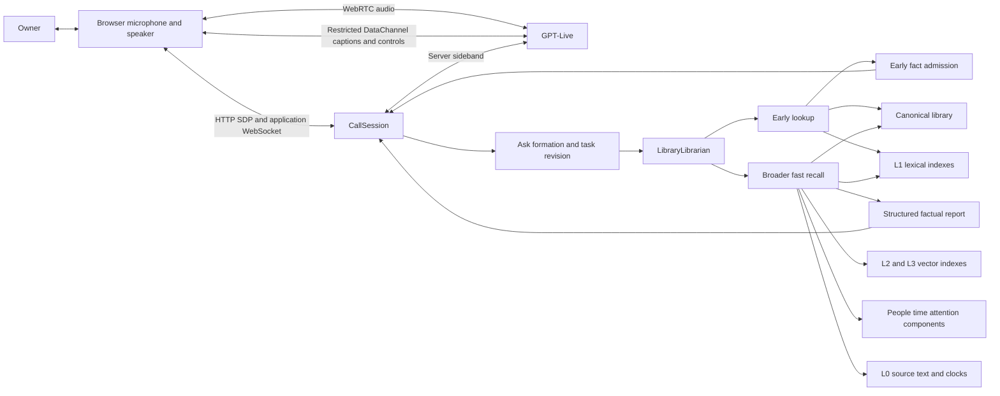
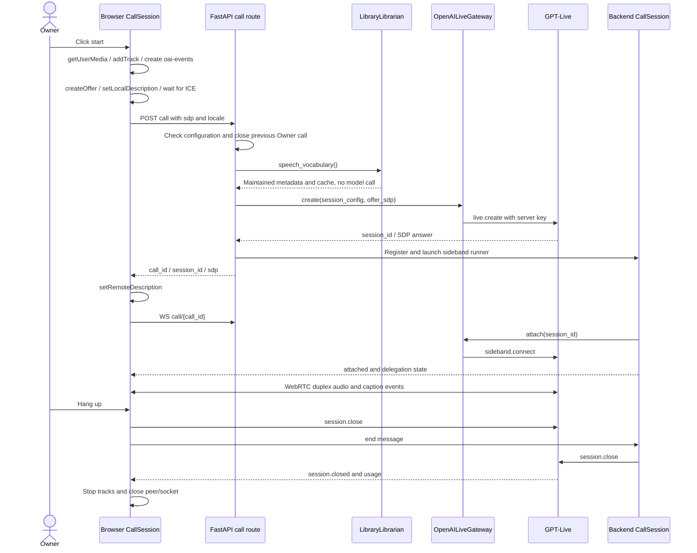
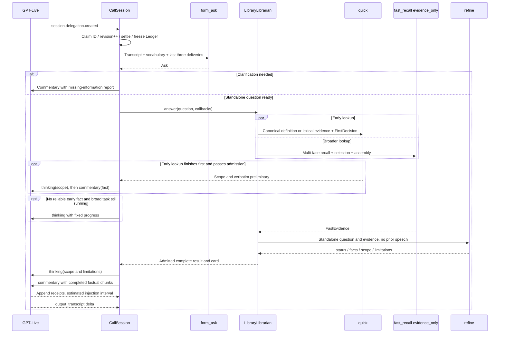
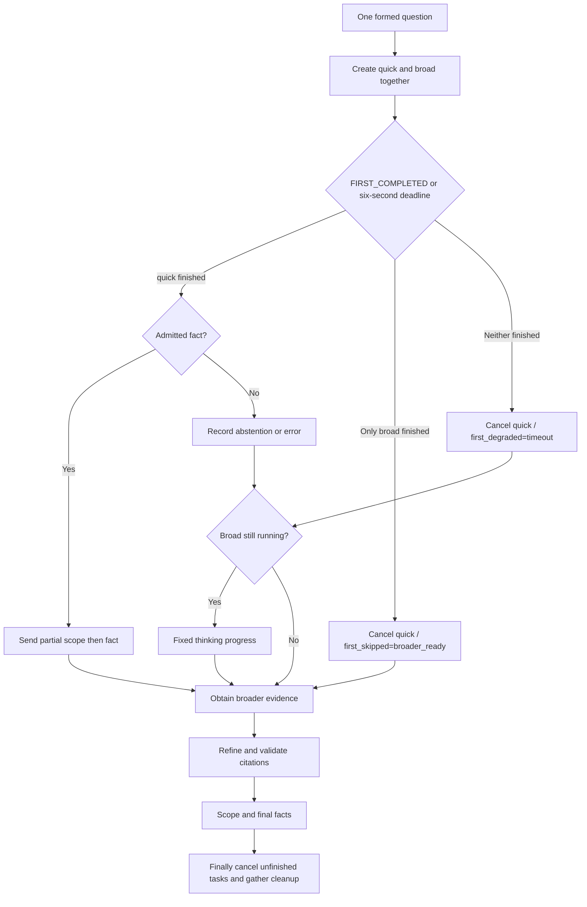
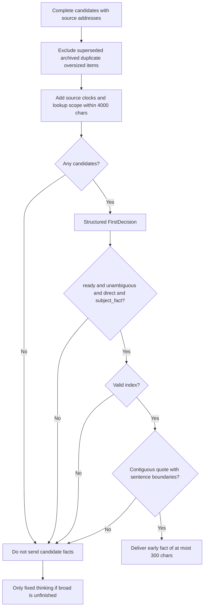
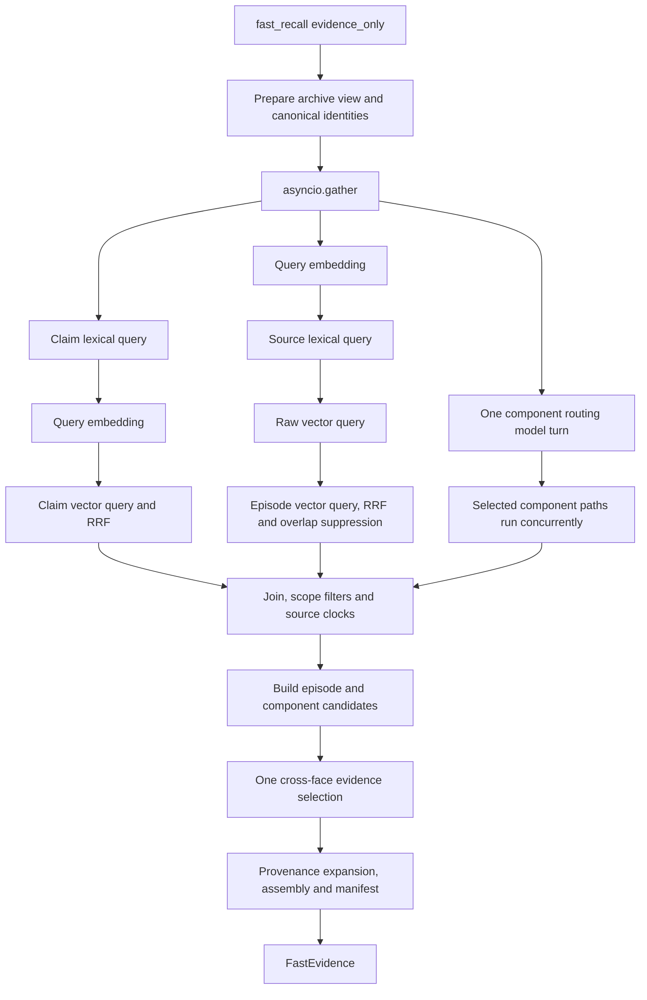
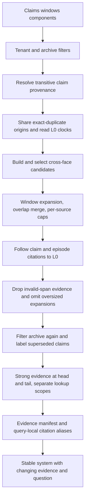
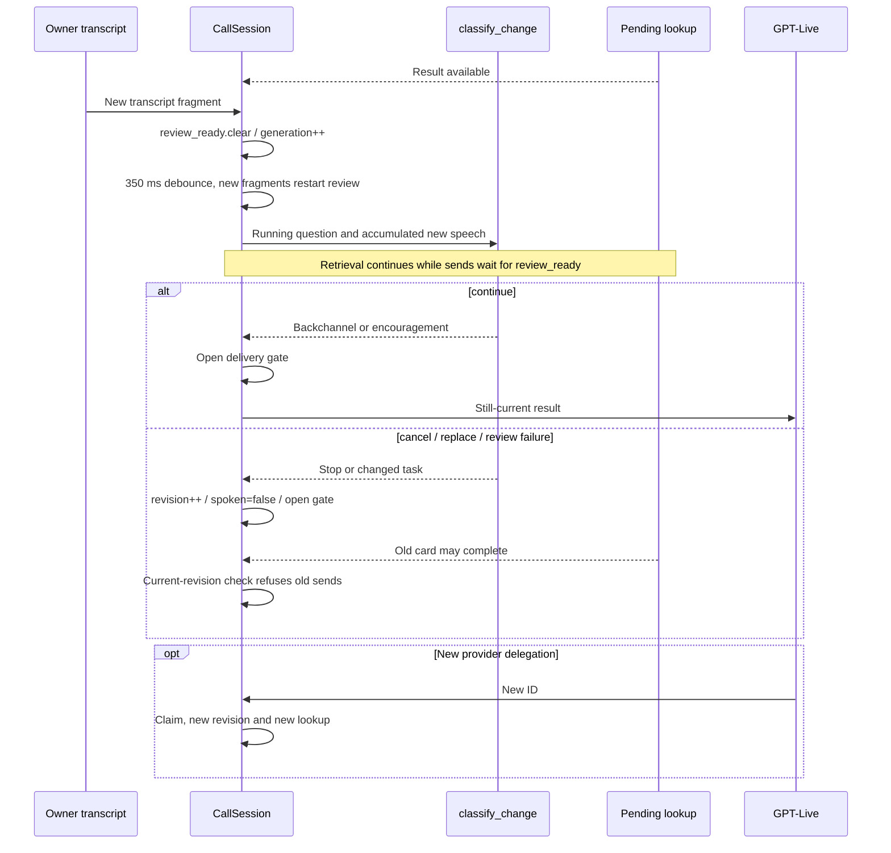
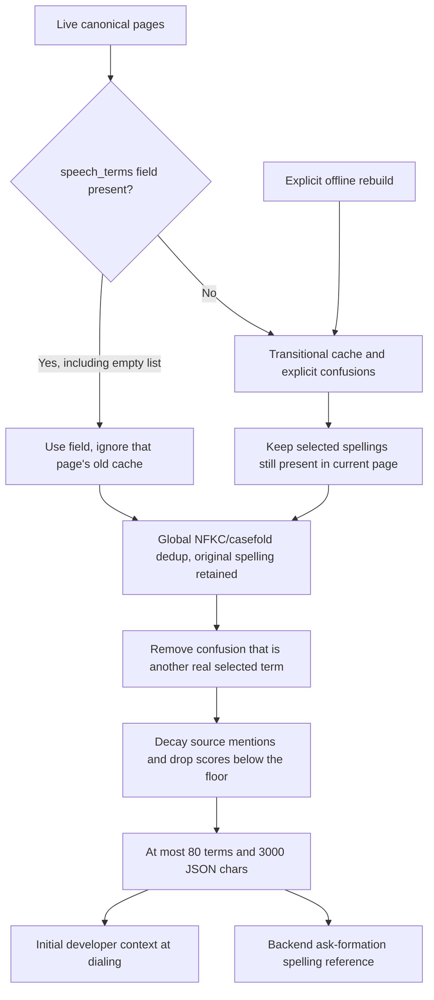

# Voice mode: architecture and implementation

**English** | [简体中文](voice-call-implementation.zh-CN.md)

Implementation reference: September 22, 2026. The voice baseline is commit `630896abaef9a4eb64ffcaf6be8d7102fb782063`; the source-time policy and admission additions are described in [evidence scoring](evidence-scoring.md).
This document expands the complete calling, duplex conversation, question formation, retrieval, evidence composition, progressive delivery, vocabulary, performance and observation paths. The body is self-contained. Values describe this revision's defaults or explicit voice overrides, not the live configuration of every deployment. Examples are synthetic.

## 1. Goals and boundaries

The Owner can continue speaking, follow up, add conditions, correct names and interrupt answers. The system must resolve references such as “the second point” and return traceable library facts. Correct subject, requested aspect and intact qualifications take priority over earlier delivery.

Three completion conditions differ: the backend found something, information entered the voice model's context, and the user heard it. None implies the next. “Let me check” is not the first useful answer.

Voice lookup uses a fixed fast-recall workflow. It is not a separate autonomous multi-round agent and does not automatically escalate to deep recall, web search or library writes. Calls create no compile, draft or Owner statement; captions are not automatically ingested sources. The separate Live Context feature has web-search, planning and suggestion-card machinery that is not this calling implementation.

## 2. Architecture



| Layer | Owns | Does not own or know |
|---|---|---|
| GPT-Live | Listening, speaking, backchannels, clarification, delegation, explanation and speech interruptions | Direct access to private library indexes |
| Browser | WebRTC, captions, mute, hangup, evidence cards and diagnostic export | Project API key; knowledge/instruction injection |
| `CallSession` | Transcript ledger, delegation deduplication, revisions, timeouts, delivery types and receipts | Semantic correctness of retrieved candidates |
| `LibraryLibrarian` | Standalone questions, concurrent early/broad retrieval, factual reports | Which sentence the Owner actually heard |
| Core recall | Fusion, selection, provenance expansion, citation admission and structured synthesis | Concrete HTTP/database clients |
| Service adapters | Meilisearch, Qdrant, Postgres, Git, model and scorer connections | A new authority over knowledge |

The primary audio path connects browser and provider directly. The sideband also receives reflected audio events, but the gateway drops `session.output_audio.delta` and `session.input_audio.append` before serialization. The backend is not a mandatory audio relay and does not run a custom ASR→text LLM→TTS chain.

Client delegation allows an independently selected backend model. Live's `CALL_MODEL` defaults to `gpt-live-1`, with `CALL_VOICE=marin`. The text helper role is separately configured by `LLM_MODEL_CALL`, borrowing recall/default when unset. Wiring pins that role's reasoning effort to `none`; the voice model does not perform all retrieval itself.

## 3. Knowledge substrate and four access levels

| Level | Content and storage | Use in a call |
|---|---|---|
| L0 | Postgres verbatim blocks, structure and aligned source clocks; original media in private object storage | Read and validate exact source spans; supply dates and attribution |
| L1 | Meilisearch source lexical index and canonical-claim lexical projection | Exact names, keywords and material not compiled into canonical |
| L2 | Qdrant raw-text vectors and episode title/description vectors | Semantic and topic recall |
| L3 | Git canonical documents, overviews and anchored claims, with lexical/vector projections | Definitions, decisions, states and facts composed across sources |

These are views over the same source, not a ladder that tries L3 and falls back through L2/L1/L0. L0/L1 remain available regardless of semantic indexing or canonical treatment. L0 and canonical are authoritative; indexes, vocabulary caches and component projections are rebuildable. Episode segmentation/description manifests are kept generation records, replayed on rebuild.

Every source uses `source_id + block_start + block_end`, an inclusive interval rendered as `[cite: source-id ¶a-b]`. Canonical provenance may pass through other claims; recall resolves the same provenance graph to source intervals. Calls use text/captions by default and do not fetch original images for the model.

L2 builds independent raw and episode representations at ingest: raw preserves source text; episode titles/descriptions improve discoverability. Semantic segments may overlap within bounded neighboring-topic boundaries without rewriting source blocks. Both representations rank independently and resolve to L0. A derived description is neither verbatim text nor a second knowledge authority.

## 4. Dialing, connections and shutdown



The browser requests echo cancellation, noise suppression and automatic gain control; behavior depends on browser/device support. It creates the DataChannel before the offer and installs listeners before connecting so early events have a consumer. ICE gathering waits at most ten seconds, then proceeds with the candidates collected; that timeout does not itself fail the call.

| API | Input/output | Meaning |
|---|---|---|
| `GET /v1/users/{uid}/call` | `configured, reason, detail, model, voice, live` | Availability only; never dials |
| `POST /v1/users/{uid}/call` | `sdp, locale?`; 201 with `call_id, session_id, sdp, expires_at:null` | Creates a session; missing configuration yields 503, provider creation failure 502 |
| `WS /v1/users/{uid}/call/{call_id}` | Sends `attached, delegation, usage, error, closed, ping`; accepts `end` | Application state and hangup, not audio |

The application socket checks the call's `user_id`; a wrong ID returns `unknown_call`. Deployment authentication remains the responsibility of the access boundary: a tenant ID in a URL is not authentication.

Provider configuration permits the browser to send only `session.close`, `session.input_audio.mute` and `session.input_audio.unmute`, rather than relying on frontend convention. The mute indicator waits for provider confirmation. This revision accepts `locale` in the request schema but does not use it in the route to select voice prompts dynamically; prompt language comes from the deployment catalog/overlay.

The backend checks limits every second: 180 seconds without new Owner transcript, or 1,800 seconds total by default; zero disables the corresponding limit. Twenty seconds without an application-socket subscriber closes an orphan; ping runs every thirty seconds. Normal browser hangup waits for the close event with a fifteen-second media-cleanup fallback. Page unload sends both close requests best-effort and cleans up immediately. API shutdown closes registered sessions; sideband loss ends application-side call state.

The registry and transcript are process-local memory. The per-Owner replacement policy also lives in one process, not a global multi-replica lock. Reattaching the application socket replays current cards but cannot recover a Live session after process restart. The desktop tray opens the browser at `/#/steward?call=1`; the URL arms the view and never starts a billed call automatically.

## 5. Conversation context: transcript to standalone question

### 5.1 Ledger and frozen input

`Ledger` stores `Fragment(speaker, text, start_ms, end_ms)` and concatenates deltas exactly, without inserted spaces or removing repeated words. Speakers are grouped independently; a gap greater than 1,200 ms opens another row for that speaker. A listening sound cannot split the other speaker's sentence. Rows are context/display units, not asserted turn boundaries.

A provider delegation gives an ID, target and offset, not a complete question. The engine waits for 350 ms of quiet Owner transcript, bounded by 1.2 seconds after delegation; it does not run another audio VAD. Before vocabulary I/O, it copies the ledger so subsequent speech cannot change the question on an earlier card during an asynchronous wait.

Ask formation receives:

1. Recent transcript with a target budget of 1,800 characters. Complete rows are retained; the newest single row can exceed the budget.
2. The latest three delegations having both `ask` and `said`. The latter is explicitly text handed to Live, not completed playback.
3. Canonical titles stably ranked by token overlap with the original heard text. Title text has a 2,400-character budget, with list formatting additional.
4. The spelling vocabulary, concatenated with titles; the complete input is not capped at 2,400 characters.

`form_ask()` uses a byte-stable SystemMessage and puts changing vocabulary, history and transcript in the HumanMessage, transcript last. It returns `AskDecision(ready, question, clarify)`: resolve “it” or “the second point,” apply the latest correction, repair names only when context supports it, and add no unasked scope. Relative date expressions remain intact for retrieval with a clock.

A named subject absent from vocabulary remains searchable; discovery questions such as “which projects have I been working on?” must not require the user to enumerate the answer. Missing subjects or unresolved references produce a missing-information report for Live to phrase as a clarification. Ask formation times out after six seconds and falls back to the Owner's latest words with a degradation marker. This preserves availability but may retrieve poorly for a bare “the second point.”

### 5.2 End-to-end delegation sequence



## 6. Two-phase scheduling and early fact admission

### 6.1 Scheduling

Every formed question creates `quick_task` and `broad_task`. Both share the resolved tenant, `as_of`, canonical document set and archive policy. They read live indexes independently; this is not a transactionally consistent multi-database snapshot.



If both tasks are already complete, code handles quick first. If broad alone finishes first, it does not wait out six seconds for quick. This may give up an imminent partial result to begin final synthesis earlier. Early failure does not cancel broad. Cancellation or call closure cancels and joins both lookup branches.

### 6.2 Early evidence: title first, lexical when appropriate

`canonical_first_claims()` normalizes question, title and slug with NFKC, casefold and whitespace/underscore/hyphen normalization. It looks for the complete name, at least three characters long, with Latin-letter/digit boundaries. It does not perform fuzzy entity guessing. A title identity takes precedence over a shared slug.

- One matching page: consider only its overview `definition` and `summary`, definition first. Resolve source citations; absent citations or missing/ambiguous anchors disqualify it.
- Multiple subjects, duplicate identities or a matched page without eligible overview: return no candidates and wait for broader recall. Do not search unrelated pages for incidental mentions instead.
- No page match: use bounded lexical fast recall.

The lexical early pass disables embeddings, vectors, component routing, JEV scoring, glance and ordinary answer generation, using `evidence_only=True`. It retrieves eight claim candidates and retains six; three window candidates and retains two; zero episodes; up to six claim-provenance passages. One `FirstDecision` model call follows, with no additional freeform summary call.

### 6.3 Admission activity



Candidates pass through `speakable()` before exact-copy checking. “Verbatim” therefore means the normalized candidate shown to the selector, not byte-for-byte source-file extraction. At most eight candidates survive, each at most 6,000 UTF-8 bytes; all cards including metadata fit within 4,000 characters. Oversized records are omitted whole rather than losing trailing qualifications.

`FirstDecision` contains `disposition`, `index`, `subject`, `support`, `record_kind` and `quote`. Only `ready + unambiguous + direct + subject_fact` proceeds. Code checks the index, 300-character bound, contiguous substring and surrounding sentence boundaries; it rejects invented wording, spliced noncontiguous sentences or clipped clauses. Sentence boundaries are punctuation heuristics, not full linguistic parsing.

| FirstDecision field | Allowed values/constraints |
|---|---|
| `disposition` | `ready` / `needs_review` / `no_answer` |
| `index` | Integer, default -1; must address this candidate list when used |
| `subject` | `unambiguous` / `ambiguous` / `unknown` |
| `support` | `direct` / `indirect` / `none` |
| `record_kind` | `subject_fact` / `test_or_usage_instruction` / `question_or_hypothesis` / `other` |
| `quote` | Empty by default, at most 300 characters; admitted quotes require contiguous copying and sentence-boundary checks |

The model still judges identity, relevance and essential qualifications outside the quote. Enumerations and exact-copy checks mechanically reject nonconforming outputs; they cannot prove that the record was understood correctly. “High confidence” is implemented as multiple admission conditions, not a calibrated probability threshold.

A synthetic counterexample: a source says “Test by asking ‘What is Lyrra?’; show a quick-view card, then upgrade it to a full card.” This is a UI test instruction, not evidence that Lyrra is a system that upgrades cards. It must be classified `test_or_usage_instruction` and withheld. Sending that interpretation through thinking is also inappropriate: thinking can influence later speech.

## 7. Broader retrieval and scoring

### 7.1 Actual concurrency boundaries



The three outer branches run concurrently. Within claims, lexical→embedding→vector are sequential awaits. Within source windows, embedding→lexical→raw vector→episode vector are sequential too. The same query is normally embedded separately by the claim and source branches. Lower-level functions accept precomputed vectors, but the voice caller does not currently share one between these branches.

With semantic retrieval disabled, lexical L1/L3 remain usable; L2 raw/episode and semantic summaries are skipped. Failure behavior is not uniformly independent: routing and selection have explicit fail-soft paths, whereas a main-index failure inside the retrieval gather can fail broader lookup.

### 7.2 Rank fusion and deduplication

RRF fuses ranks instead of incomparable backend scores: `score(x) = Σ 1 / (60 + rank_i(x))`, with zero-based ranks in this implementation. Claims and source windows have separate RRF rankings; a later cross-face selector composes them.

Claims use `(document_path, anchor)` identity. Lexical/vector matches combine path markers, then equality/containment dedup keeps more complete text at the better rank before applying the candidate cap. Default candidate depth is eighty; voice does not shrink it to the final twelve claims.

Source rankings use `(source_id, block_start, block_end)`. Each backend over-fetches twice the requested count before fusion, overlap suppression and the final candidate cap, so duplicate representations do not consume all slots. The default sixty-window candidate pool can therefore request 120 items from each underlying source retrieval face before the fused pool is capped at sixty.

Exact spans accumulate RRF signal. Merely overlapping spans undergo greedy suppression rather than interval union into a large cross-topic passage. Raw text outranks lexical singleton ownership, and both outrank episode-only derived representations. The winning text/span survives, score becomes the maximum of the pair rather than their sum, and path/episode signals are combined.

### 7.3 Component paths

With enabled components, one routing model turn chooses at most four path calls and validates their Pydantic arguments; `run_paths()` executes them concurrently. Routing defaults to ten seconds, each path to fifteen seconds, both subject to the delegation's thirty-second outer timeout. No offered paths means no routing call.

| Path | Purpose | Declared cap |
|---|---|---:|
| `person(alias, identity)` | Facts about a person resolved by name, alias or identity | 24 |
| `people_around(subject)` | People and relationships connected to a project, team or topic | 24 |
| `timespan(since, until, about)` | Source spans in Owner calendar days and claims citing those sources | 12 |
| `attention(limit)` | Claims used by earlier consultations: attention, not entity relevance | 12 |

Paths are structured lookups, not additional similarity rankings, and do not enter RRF. The framework orders their results against the question, applies path caps and a shared default 6,000-character budget, and deduplicates in both directions. Content already shown in ranked faces is not repeated; `via:<path>`, arguments and omission records survive. Under `select`, component items join the common candidate pool and move to ordinary claim/window sections only when selected; lookup receipts remain in their original section.

Current `timespan` **does implement** `about` filtering: every subject token must occur in normalized, casefolded text. Matching blocks keep two neighboring blocks on each side, bounded by the time span; touching ranges merge. Empty `about` requests period-wide material. The time-block storage query also has a 5,000-row ceiling; broad ranges are not unlimited enumerations. Dates must be `YYYY-MM-DD`; the routing model resolves relative expressions against `as_of` and the Owner's zone. A claim enters the time result when its cited source is in the period's source set; this does not prove the claim's described event itself falls within that period. Independent lexical/vector branches do not inherit this date filter, so synthesis must retain each branch's actual scope.

### 7.4 One cross-face selection

Voice overrides the strategy to `select`. A model selector returns structured coordinates, or a scorer configuration inherits the deployment's TypeSafe/JEV implementation. Candidates include claims, episode summaries, windows and component items. Voice disables glance, so routine whole-library directory context and whole-page selection are absent.

JEV scores the expected level on a four-level usefulness rubric, divided by three to produce 0–1: irrelevant, same subject without answering, useful partial evidence/context, directly answers. Default keep floor is 0.5. This is usefulness for the query, not truth probability or early-answer confidence.

One logical scoring pass can issue several HTTP requests: defaults are fifty items and 24,000 serialized candidate characters per shard, concurrency sixteen shared across calls on the cached adapter. A single oversized candidate may occupy its own shard; the character bound is not a strict whole-request-body bound. Candidate bodies over 1,500 characters retain approximately two-thirds head and one-third tail with a truncation marker; origin/time metadata is additional. Named keys such as `c1` avoid addressing candidates by model-counted array positions.

The adapter has a six-second request timeout and at most one retry for 429/5xx/network errors, with a 250ms minimum delay and respect for `Retry-After`. A cooldown at least as long as the request timeout leaves the shard unscored. Voice's outer selection timeout is five seconds and can cancel the pass first. The HTTP client reuses connections. Failed shards and invalid scores are unscored, not zero; total failure falls back to ranked evidence. Scorer input tokens are recorded separately from chat-model tokens.

A question-only Noul and Choice run together in one request, alongside retrieval (two-second ceiling). The early and broad lookups share this task. Noul probability 0.8 identifies source-time intent; Choice confidence 0.7 admits a supported calendar period, whose boundaries core computes in the owner's timezone. Before scoring and after assembly, exact source-clock checks exclude out-of-period or undated material and split mixed verbatim windows into bounded block runs. Ranked fallback cannot restore excluded records. An unsupported requested interval produces an unresolved report; unavailable validation produces a distinct failure report, without asking the user to restate dates. With no admitted evidence, early facts and final answer-model generation are withheld. A negative intent preserves the original scoring strings; an absent policy preserves the existing lane. Compact computed relations accompany admitted source clocks, explicitly distinguished from event dates. Optional probability distributions and confidence remain diagnostic; they do not add a relevance-confidence filter. The bounded stage preview includes policy/period decisions, aggregates and score samples, not a complete persisted score log. Details and measurements: [evidence scoring](evidence-scoring.md).

Selection retains ranked anchors: selected items first, then ranking heads, up to eight claims, four episodes and four windows, subject to face caps. Components have no anchors. Voice's episode cap is three, so it cannot retain four episode anchors. Final context therefore does not mean “every item passed JEV”: low-scored or unscored ranking heads may survive. Selection timeout/error restores ordinary ranked heads; the component fallback remains under its own budget and retains scope labels.

## 8. Context composition and provenance



Composition is more than concatenation. Each item preserves an evidence address, retrieval origin and source clocks:

- `RetrievalOrigin(route, method, arguments, bounded)` describes the lookup and its actual filters. Only exact duplicates share origins; containing/overlapping spans do not inherit scope from each other.
- `EvidenceTime(source_id, span, occurred_on, first, last, timed_blocks)` records source occurrence, earliest/latest aligned block times and clock coverage. Missing dates remain unknown; ingest time is not substituted.
- Source title, section breadcrumb, canonical path/anchor and current/superseded/archive labels distinguish identities, historical states and material kinds.

`CachedSources` caches an asyncio Task per source within one `fast_recall`, checks tenant identity and shares in-flight reads among consumers. `enrich_evidence()` reads distinct sources with concurrency eight and verifies returned source/tenant identity. This cache is not shared across early/broad passes or all questions; components may use separate reads/caches.

Ordinary assembly expands only lexical-only hits forward by one block with a 700-character target budget. Whole-block addition can exceed that target. Raw/episode spans already have natural boundaries; `bounded` structured lookups do not expand. Only actually overlapping windows with identical origins merge, without unretrieved bridge blocks. At most three passages per source remain. Ordinary windows keep a 2,500-character head plus a truncation notice; the address still refers to the original span. **A complete address does not mean all its text was shown.**

The selected claims can add four provenance passages, and episodes one. Invalid source intervals remove associated claims/summaries and record `provenance:invalid_span`. An expanded passage exceeding 6,000 characters is omitted whole while its address-validated claim remains, recording `provenance:oversized_passage_omitted`. This differs from ordinary-window truncation and means synthesis does not always see all cited source text.

The deterministic long-context ordering alternates strongest evidence at the head/tail and weaker evidence toward the middle, without another model call. Evidence is not repeated across sections; failed, empty or unselected lookups retain scope receipts. Broader recall may retain labeled superseded history, while early recall excludes it. Default archive filtering runs at the index, assembly and later-expansion boundaries.

Calls do not routinely enable whole-library glance, query planning, a separate reranker, timeline expansion or annotated-window mode. Keeping canonical documents for identity, archive and provenance does not mean their entire bodies enter the prompt.

## 9. Final factual report and citation admission

`FastEvidence` returns normal fast-recall retrieval, selection and assembly, stopping before ordinary answer generation with `evidence_only=True`. Voice then invokes `refine()` once rather than producing an ordinary answer and running another model solely to rewrite it for speech.

```json
{
  "status": "partial",
  "facts": [
    {"text": "As of September 10, 2026, the recorded Lyrra version was 0.4.", "citations": ["[cite: s01 ¶8-9]"]}
  ],
  "scope": "One dated version record.",
  "limitations": ["The evidence does not establish that this is still the latest version."]
}
```

| Field | Bound | Purpose |
|---|---|---|
| `status` | answered / partial / unresolved | Model-judged completeness |
| `facts` | At most six; text at most 600 characters each | Self-contained qualified facts, each requiring citations |
| `scope` | At most 300 characters | Established subject, dates and coverage |
| `limitations` | At most four, 200 characters each | Requested aspects not established |

Synthesis receives only the standalone subtask and its evidence, without prior speech or retained/new classification. Even facts repeated from the early result return in full; Live decides how to communicate them using its conversation state. Partial results must not become claims of library-wide completeness, and dated records cannot establish the latest version without further support.

Citation admission has two steps. The intersection of rendered context and typed evidence manifest defines allowed `(source, start, end)` addresses. A dynamic Pydantic/Literal schema offers only those choices, followed by another validation after parsing. `s01` is query-local. Source-only `[cite: s01]` expands to its exact admitted intervals; disjoint intervals do not gain invented bridge blocks.

Answered/partial results without facts, facts without citations, unknown handles or invented spans fail. Unresolved results discard any speculative facts and return fixed insufficient-evidence wording. No admitted citations takes this branch directly. The gate validates addresses and traceability, not semantic entailment; a model can still misinterpret a real source.

## 10. Delivery into duplex voice context

| Content | Event | Result accounting |
|---|---|---|
| Partial scope, final scope/limitations and waiting progress | `session.thinking.append` | Not `said` or first-result latency |
| Admitted early and final facts | `session.commentary.append` | Added to `said`; first sets result latency |
| Missing-information clarification and failed/incomplete lookup notices | `session.commentary.append`, `result=False` | Not factual results; do not consume result budget |
| Application-authored behavior controls | API supports `session.instructions.append` | Standing policy is set at creation; the lookup sender does not turn sources into instructions |

Every update keeps the original provider delegation ID; multiple appends can belong to one task. The official append bound is 500 tokens. This implementation conservatively caps each append at both 420 characters and 480 UTF-8 bytes, including rare CJK characters/emoji. Long sentences prefer word boundaries when split; every send entry, including clarification, enforces the bound.

`SpokenChunker` removes citations, Markdown decoration and link destinations. Chinese/English terminal punctuation or newlines release chunks, with eight-character minimums for both first and later chunks. Decimal/version dots do not normally end a sentence; an open `[` prevents a partial citation escaping. A colon-only introduction is not released before its list, avoiding a prompt for Live to invent the missing list. Exceptionally long completed sentences can still be split by byte limits.

`_Attempt` callbacks enqueue without I/O. Admitted early results queue scope then preliminary immediately. Final text buffers until the librarian succeeds and schema/citation checks finish, then queues scope followed by facts. Failure releases none of the buffered final report. This is streaming completed results across phases, not reading unvalidated JSON tokens aloud.

`SPOKEN_BUDGET_CHARS=4000` is a pre-send threshold against accumulated `said`; the final chunk may overshoot slightly. The ordinary schema's six 600-character facts plus an early result fit this scale. Scope, progress and failure consume none of it. After nine seconds without a result or previous progress update, a one-time fixed thinking update is sent; an earlier checking update prevents repetition.

Scope and facts are sent in order without waiting for the scope ACK before sending facts. ACK means estimated context injection, not finished speech. Thinking is usable factual context, not a hidden reasoning channel; it must not receive unverified candidates, secrets or private reasoning. [Official event semantics](https://developers.openai.com/api/docs/guides/live-delegation#send-the-right-kind-of-update)

## 11. Interruptions, corrections and obsolete results



`_claimed` records provider IDs before task launch, preventing duplicate lookups for repeated events. New delegations increment session revision: old work can finish its card but cannot send further speech. Every `_hand_over()` waits for review and checks revision/closing again; checking only at lookup start would be insufficient.

New Owner transcript during an active question first pauses sends, then runs a debounced `continue/cancel/replace` judgment. Classification has a three-second timeout; failures conservatively suppress further old-result speech and record unresolved. New fragments cancel the preceding review, and generation checks prevent stale decisions overwriting newer speech.

Arbitrary sound does not cancel retrieval. Backchannels, encouragement and unrelated remarks do not change the task; explicit cancellation or correction of subject/date does. Replace does not itself launch another lookup; a new Live delegation does. Review mainly covers a formed ask still searching/answering, not every possible intent change throughout the call.

Local revision cannot retract context already accepted by the provider. If wrong material has been spoken, Live must communicate the correction. A receipt cannot establish what was heard. Yielding speech and canceling backend work are different actions: Live handles the former, session controls future result validity.

## 12. Speech vocabulary: provenance, maintenance and two consumers

### 12.1 Purpose

Vocabulary targets coined project names, uncommon people names, mixed-language terms and confusing acronyms. Frequency does not admit ordinary common words. This path neither calls another ASR service nor rewrites the provider's raw captions.

`session_config` places a spelling reference in the initial developer context's `<speech_vocabulary>` section for Live. Backend `form_ask()` separately receives vocabulary and titles ranked for the current utterance to repair query names. Live's opening reference remains fixed during the session; subsequent ask document views can refresh by TTL. Measure these effects independently: a corrected retrieval question is not proof of a corrected raw transcript.

The separate Realtime transcription API provides `keywords` context configuration. This implementation does not transplant that field into the GPT-Live WebRTC session and has no phonetic decoder or ASR fine-tuning path. [Transcription context API](https://developers.openai.com/api/docs/guides/realtime-transcription#add-transcription-context)

### 12.2 Canonical metadata

```yaml
speech_terms: [{"term":"Lyrra","confusions":["leera"]},"洛芮"]
```

Normal compilation maintains this field through `create_document`, `set_fields` or `rewrite_overview(fields)` in the same draft/commit. It is serialized as single-line JSON, valid YAML. Write faces and the final gate enforce: a list of at most forty entries; terms 2–80 characters long, normalized and unique, without control characters or reserved delimiters; exact occurrence in page body, including headings. Latin token boundaries prevent fabricated acronyms cut from longer words. Each term allows at most six bounded confusion spellings.

Confusions should come only from explicit Owner corrections, a semantic compile-contract requirement. The gate checks shape and bounds, not whether the Owner actually supplied an alias, whether a term is difficult to recognize, or vocabulary completeness. A body edit that invalidates a stored term requires metadata repair before commit. Read-time collection is not a replacement for the write gate.

### 12.3 Derived cache for historical pages

The explicit operator script `scripts/ops/build_speech_lexicon.py USER [--dry-run] [--model MODEL] [--confusion 'Lyrra=leera']` runs outside dialing. It scans live canonical page bodies in 12,000-character windows with 160-character overlap. Each structured extraction returns at most forty terms; only spellings actually present in supplied text survive. Model-invented pronunciations and aliases are not accepted.

Page scanning defaults to concurrency three with 180 seconds per page. A cross-page curation pass can select only source-checked candidates, at most 300 per batch and eighty outputs; large pools reduce through batches before final selection, with a 240-second overall curation timeout. Risk levels 1/2/3 and page coverage guide prioritization, not measured ASR accuracy.

The cache is `ENGINE_DIR/derived/speech-lexicons/<sha256(user_id)>.json`, or under the canonical root's parent without an engine directory, outside canonical Git. It stores version, tenant, page digests, model/prompt recipe, terms/risks/origins, selected terms, explicit confusions and failures. Unchanged pages with the same extraction recipe reuse results; changed pages rescan, failures retain earlier work and are recorded for later handling. A temporary file and `os.replace` make replacement atomic. There is no periodic extraction job; historical caches require an explicit rerun after compile batches.



Deleted/archived pages contribute nothing. An explicit `[]` deliberately clears a page and cannot fall back to old cache. With no cache, only metadata contributes; startup does not silently dump all page titles. Before activity preparation, rendering prioritizes maintained entries; afterwards source activity determines rank. Rendering globally deduplicates spellings and removes confusions also naming another actual term. It does not solve every ambiguous mapping: a confusion shared by multiple terms still needs topic/sound-based clarification.

Output is bounded to eighty terms and 3,000 JSON characters, with wrapper instructions additional; oversized entries are omitted whole. Dialing runs no extraction/curation model. A vocabulary failure loses the enhancement rather than disabling calling. Official prompting guidance supports language, pronunciation and clarification policies but does not establish the effectiveness of this project's vocabulary. [Live prompting guide](https://developers.openai.com/api/docs/guides/live-prompting)

### 12.4 Source-activity ranking and fade-out

Compilation still selects `speech_terms`. Activity ranks admitted spellings only: it neither truncates candidates by frequency before admission nor calls JEV or another model. Compiled metadata independently admits spellings. The transitional historical cache retains its pre-decay selection under the original ordering and budget: faded slots do not backfill previously omitted historical hints that could introduce new phonetic ambiguities. New compile metadata can still admit new terms. `sync_projection` incrementally prepares activity after normal commits; `rebuild_projection` (including the L3 path of `rebuild_derived`) reconstructs it from canonical + L0. Explicit historical vocabulary preprocessing also refreshes activity. The atomic file is `<sha256(user_id)>.activity.json` beside the existing cache, holding page dependency digests and term → source_id → occurrence dates. It is derived, neither authoritative knowledge nor a kept record.

Only raw blocks that **actually contain the spelling**, within that page's claim citation spans, supply dates. Shared citation/provenance projection resolves transitive claim references; `block_instants` supplies aligned source clocks. When a block clock is unavailable, only the source's declared `occurred_on` date may substitute, never ingestion, compilation or page modification time. Dates use UTC calendar days; future days do not vote. Duplicate claims, overlapping spans and multiple pages share one vote per term/source, using its latest occurrence day no later than today.

The initial score is `sum(min(3, distinct_sources_on_day) * 2 ** (-age_days / 60))`. The half-life is 60 days. A score below 0.25 leaves the call reference even when there is spare capacity. New source mentions can reintroduce a faded term; original `speech_terms` and correction mappings remain intact. Within that admission boundary, rank precedes the final 80-term/3,000-character budget. The threshold supplies actual exit: decay alone would never remove a word from an underfull list. These are explicit initial policy values, not ASR-calibrated thresholds.

A wholly undated term retains low-priority eligibility at 0.25: it is not labelled recent and cannot honestly expire by age. An unknown observation cannot revive another already dated, expired occurrence. A future-only term does not enter. Before the first activity projection after upgrade, legacy vocabulary order remains; the next projection sync or explicit derived rebuild enables ranking. A page changed between canonical commit and activity preparation temporarily contributes no hints, preventing a digest mismatch from reviving an expired word as an undated new candidate.

Dialing reads local dates and computes scores, without scanning L0 or requesting a model; an existing Live session still keeps its fixed opening reference. There is no periodic job: elapsed time takes effect on the next read. Unchanged page dependencies reuse dates; a full rebuild re-reads sources, neither adding votes nor renewing old words. Source-read failures preserve the previous complete file and are logged without failing the committed knowledge projection; the next sync/rebuild retries. Missing historical citations remain undated rather than acquiring invented dates. Tenant/page/source identity checks preserve isolation. An Owner correction supplies a new date only after ordinary `owner-dialogue/v1` ingestion and compilation cite a block actually containing the name. Live transcripts and consultations do not currently add usage votes automatically.

## 13. Latency and cost mechanisms

| Implemented mechanism | Savings | Tradeoff or boundary |
|---|---|---|
| Browser-provider WebRTC | No mandatory backend audio relay/transcoding | Still depends on network, device and provider |
| Reused clients and model instances | Avoid constructing clients per delegation | Not a global cross-process pool |
| Canonical warmup and 60-second TTL | Fewer Git-tree reads on subsequent asks | New commits may wait for TTL; not atomic snapshots |
| Concurrent early/broad lookups | Direct short facts can arrive sooner | Adds one small judgment; not faster for every query |
| Cancel unfinished early lookup when broad is ready | Avoid waiting six seconds for preliminary | Can discard an imminent early result |
| No scorer/embedding/routing on early path | Avoid duplicating expensive broader work | Only bounded canonical/lexical evidence |
| Concurrent claim/window/component branches | Wall time follows slower branch rather than sum | Internal awaits remain sequential |
| Concurrent JEV shards and connection reuse | Score a pool in parallel | Shards/retries remain bounded by five-second outer selection |
| Query-local L0 task cache and eight-way clock reads | Avoid duplicate source reads | Not one shared cache across early/broad/components |
| No whole-library glance | Smaller prompt and no routine page-pick call | Less global directory context; canonical scope remains |
| No planning or extra reranker | Fewer sequential model calls | No multi-query expansion or extra reranking benefits |
| Broad candidate pool, bounded final context | Retain retrieval breadth while controlling synthesis size | Budgets can still omit useful evidence |
| Bounded provenance count/length | Large agent sessions cannot flood synthesis | Omissions need disclosure; not complete coverage |
| Vocabulary maintained during compile/preprocessing | No extraction model on dial | Older pages need maintenance; no Live vocabulary hot refresh |
| Completed sentences/facts returned in chunks | Live need not await later phases | Each chunk can still be paraphrased or repeated |
| Reuse still-current conversation results | Rephrasing/explanation need not re-query | Delegation remains a Live judgment |
| No second speculative raw-ASR workflow | Avoid duplicate retrieval on competing questions | Ask formation precedes both lookups |

Approximately, `Tbroad_evidence ≈ Tprepare + max(Tclaim, Twindow, Troute+Tpaths) + Tselect + Tassemble`. Final delivery also includes settling, vocabulary/ask formation, refine, queueing and revision review. Audible delivery additionally includes provider scheduling and playback. Overlapping stages cannot be summed as if sequential.

Typical model work is one ask call, up to one early-admission call, an optional routing call, one cross-face selection call or scorer request group, and one refine call. New Owner speech may add change classification. Empty candidates or absent citation addresses skip corresponding calls. Canceled model requests may already incur provider cost without returning final token receipts in the payload.

## 14. Parameter reference

| Scope | Name | Value/rule |
|---|---|---|
| Session | idle / max / orphan | 180 s / 1800 s / 20 s |
| Connection/close | ICE / browser close fallback | 10 s / 15 s |
| Transcript | row gap / settle quiet / settle max | 1200 ms / 350 ms / 1.2 s |
| Ask | tail / titles / earlier / timeout | 1800-char soft budget / 2400 title chars / 3 / 6 s |
| Documents | `DOCUMENTS_TTL_SECONDS` | 60 s per librarian instance |
| Delegation | total timeout / holding progress | 30 s / 9 s |
| Revision | debounce / classifier timeout | 350 ms / 3 s |
| Early lookup | deadline / candidate records / quote | 6 s / 8 / 300 chars |
| Early context | per record / all cards | 6000 UTF-8 bytes / 4000 chars |
| Early pool | claim candidate/keep, window candidate/keep | 8/6, 3/2; no episodes |
| Broad pool | default claim / fused-window candidates | 80 / 60; inherited deployment settings |
| Broad retention | ordinary claims / windows / episodes | 12 / 4 / 3; components/provenance can add content |
| Components | calls / routing timeout / path timeout / face chars | 4 / 10 s / 15 s / 6000 |
| Selection | timeout / scorer floor | 5 s / default 0.5, inherited floor |
| Provenance | claim / episode / max passage | 4 / 1 / 6000 chars |
| Delivery | per append / result threshold | 420 chars and 480 bytes / 4000 chars |
| Final schema | facts / fact / scope / limitations | 6 / 600 chars / 300 chars / 4×200 chars |
| Vocabulary | per page / confusions / terms / JSON chars | 40 / 6 / 80 / 3000 |

Python setting fields map to environment variables with the `PNEUMA_KNOWLEDGE_` prefix, for example `PNEUMA_KNOWLEDGE_CALL_IDLE_SECONDS` and `PNEUMA_KNOWLEDGE_LLM_MODEL_CALL`. `OPENAI_API_KEY` and `OPENROUTER_API_KEY` use their dedicated unprefixed names. Voice `POSTURE` overrides some ordinary recall settings; changing a normal answer cap does not necessarily change calling behavior.

## 15. Observation, captions and diagnosis

`Delegation` holds application/provider IDs, revision, ask, state, spoken, said, preliminary, answer phase, answer, detail, deliveries, elapsed time, timings, updates, observed speech and Owner changes. Application sockets send whole delegation frames; the browser upserts by ID instead of reconstructing field patches.

State follows `hearing → searching → answering → done`, with `unclear` and `failed` terminal outcomes. `spoken=false` forbids future sends and does not establish that nothing was sent previously. `answer_phase` tracks searching/preliminary/refinement; the final card can still complete.

| Field | Interpretation |
|---|---|
| `settled, asked, retrieved, completed` | Backend monotonic-clock milestones since delegation |
| `first_words, first_sent, elapsed_ms` | First successful result send; “words” does not mean physical audio |
| `updates` | Append type, phase, exact body, event ID and sending/sent/acknowledged/rejected/send_failed |
| ACK `start_ms/end_ms` | Estimated context injection on provider session clock |
| `deliveries` | Only factual commentary ACK intervals, used for caption navigation |
| `observed_speech` | Contemporaneous Live transcript assigned to latest delegation, not causal attribution |
| `progressive` | Preliminary, locator, first disposition/reason and degraded/skipped status |
| `lookup_result` | Final cited facts, status, scope and limitations |
| `stages` | Fast-recall ran/skipped/degraded states, durations and bounded previews |

Parallel stage durations do not sum to total latency. `first_lookup` includes waiting for either task to finish, not only early selector inference. Recall stage clocks start at the lane; delegation clocks start on delegation receipt; neither can be mixed directly with provider session clocks.

The frontend reducer combines provider captions, engine events and local lifecycle. Speakers group independently. A delivery boundary opens a new voice row so “let me check” and a result do not share a mark. `captionMarks` links to the latest earlier delivery for navigation; longer unlinked speech uses a 24-character display threshold. This does not prove sentence-level support.

JSON diagnostics can include exact append bodies and transcripts. Session objects are not durable call archives; exported private content needs separate handling before sharing. UI cost estimates use provider seconds and a frontend rate constant; backend models/scoring are additional. The displayed estimate is not a complete bill.

## 16. Failures, degradation and guarantees

| Condition | Handling |
|---|---|
| Missing/failed vocabulary | Continue without hints; no dial-time extraction |
| Ask failure/timeout | Owner's latest words and degradation marker |
| Missing query information | Clarification report, no paired lookup |
| Uncertain/nonconforming early result | No candidate facts sent; broad continues |
| Early timeout or broad finishes first | Cancel early, mark timeout or broader_ready |
| Routing/path timeout | Degraded path with receipt |
| Selector failure | Ranked fallback with budgets and explicit reason |
| Invalid citation/final generation failure | No buffered final facts released |
| Broad failure after preliminary | Report incomplete broader lookup and partial support |
| Changed ask or unresolved review | Suppress further old-result sends |
| Provider rejects append | Record rejected; no automatic resend in current sender |
| Hangup/query cancellation | Stop future delivery and cancel/join paired lookup |

Mechanical properties include tenant boundaries, ID deduplication, revision checks, budgets, source-address admission, exact-copy/enumeration admission and archive filtering. Semantic classification, faithful answers, sufficient coverage and Live's expression of uncertainty still require model judgment and evaluation. No hit within a scope does not mean absence from the entire library; a citation does not make every sentence correct.

Other limits include non-atomic multi-database reads, a sixty-second canonical cache, Owner retrieval zone passed only when component paths are enabled (otherwise those kwargs use UTC), no playback-completion proof, no sentence-level speech verifier, no retraction of injected context, no automatic local-ledger compression driven by provider context pressure, and no durable cross-process session state. An account of this revision must retain these boundaries.

## 17. Verification and reproducible experiments

Deterministic tests verify mechanisms, not natural speech quality. Existing coverage includes route/session ownership, duplicate/superseded delegations, early/broad races, early abstention, sentence and UTF-8 limits, failed-final buffering, quiet progress accounting, scope-before-facts ordering, citation admission, vocabulary metadata/caches, obsolete-send suppression, closure and timeouts.

Real-model verification needs at least three layers:

1. Fixed-evidence replay: same questions/candidates, comparing incorrect early admissions, abstention and retention of final facts/qualifications.
2. Identical-audio replay: separately measure raw proper-name transcription, formed-ask repair and final relevance. Do not combine these into one ASR score.
3. End-to-end duplex calls: cancellation, date/subject correction, “the second point,” repeat/expand requests, noise and interruptions. Align captions, deliveries, actual output audio and browser playback checks.

Measure delegation-to-first-fact-send, estimated injection, full backend completion and first audible fact separately. Report p50/p95, timeout/abstention rates and groups for direct facts, ambiguous identities and broad periods. Separate Live duration, text-model tokens, scorer tokens and canceled calls. Comparisons require the same harness, inputs and configuration; this document claims no measured percentage improvement in quality or latency.

Possible next optimizations include a shared query embedding, more intra-branch concurrency, shared read-only source caches across early/broad lookup, revised anchors and measured admission confidence. These are not implemented claims. Any optimization must also measure wrong early facts and missed answers, rather than only time until any utterance.

## 18. Source map

Paths are for readers with the source tree; the body already explains the behavior independently.

| Repository-relative path | Main objects |
|---|---|
| `apps/web/src/lib/callSession.ts` | start, ICE, mute/end, dual channels and teardown |
| `apps/web/src/lib/call.ts` | reducer, caption grouping and delivery navigation |
| `packages/pneuma-knowledge-service/src/pneuma_knowledge_service/api/routes/call.py` | GET/POST/WS, orphan and registry |
| `packages/pneuma-knowledge-service/src/pneuma_knowledge_service/call/gateway.py` | Provider create/attach and reflected-audio filtering |
| `packages/pneuma-knowledge-service/src/pneuma_knowledge_service/call/session.py` | session_config, _lookup, _hand_over, _Attempt and revision |
| `packages/pneuma-knowledge-service/src/pneuma_knowledge_service/call/librarian.py` | POSTURE, cache and quick/broad scheduling |
| `packages/pneuma-knowledge-core/src/pneuma_knowledge_core/recall/call.py` | Ledger, form_ask, SpokenChunker and task_change |
| `packages/pneuma-knowledge-core/src/pneuma_knowledge_core/recall/progressive.py` | canonical_first_claims, first_finding and refine |
| `packages/pneuma-knowledge-core/src/pneuma_knowledge_core/recall/fast.py` | FastEvidence, selection, provenance and manifest |
| `packages/pneuma-knowledge-core/src/pneuma_knowledge_core/recall/rag.py` | RRF, three source rankings and overlap suppression |
| `packages/pneuma-knowledge-core/src/pneuma_knowledge_core/recall/assembly.py` | Window expansion, merging and ordering |
| `packages/pneuma-knowledge-core/src/pneuma_knowledge_core/recall/evidence_context.py` | CachedSources, origins, clocks and scope rendering |
| `packages/pneuma-knowledge-core/src/pneuma_knowledge_core/recall/paths.py` | route_paths, run_paths, component dedup/budget |
| `packages/pneuma-knowledge-service/src/pneuma_knowledge_service/adapters/typesafe_scorer.py` | Sharding, concurrency, rubric and retry |
| `packages/pneuma-knowledge-core/src/pneuma_knowledge_core/recall/speech_lexicon.py` | Extraction, metadata validation, curation and rendering |
| `packages/pneuma-knowledge-service/src/pneuma_knowledge_service/call/speech_lexicon.py` | Vocabulary cache and composition |
| `scripts/ops/build_speech_lexicon.py` | Explicit vocabulary preprocessing |
| `packages/pneuma-knowledge-core/src/pneuma_knowledge_core/prompts/catalog.py` and `lang_zh.py` | Bilingual voice, ask, early admission, synthesis, change and lexicon contracts |
| `personal/desktop/src-tauri/src/call.rs` | Desktop entry |

Test entry points: core `test_call_delegate.py`, `test_progressive_call.py`, `test_fast_recall.py`, `test_rag_recall.py`; service `test_call_session.py`, `test_call_route.py`, `test_progressive_librarian.py`, `test_speech_lexicon.py`, `test_typesafe_scorer.py`; web `apps/web/tests/call.test.mjs`.

## 19. Protocol references and interpretation

Implementation claims follow the pinned source revision; API behavior was checked separately on September 21, 2026. The official [Live architecture guide](https://developers.openai.com/api/docs/guides/live) separates continuous speech from backend work; the [client delegation guide](https://developers.openai.com/api/docs/guides/live-delegation#client-delegation) covers reusable connections, stable inputs and coherent result delivery. This project adds library evidence, early admission, revisions and diagnostics. Official guidance does not establish this implementation's accuracy.
