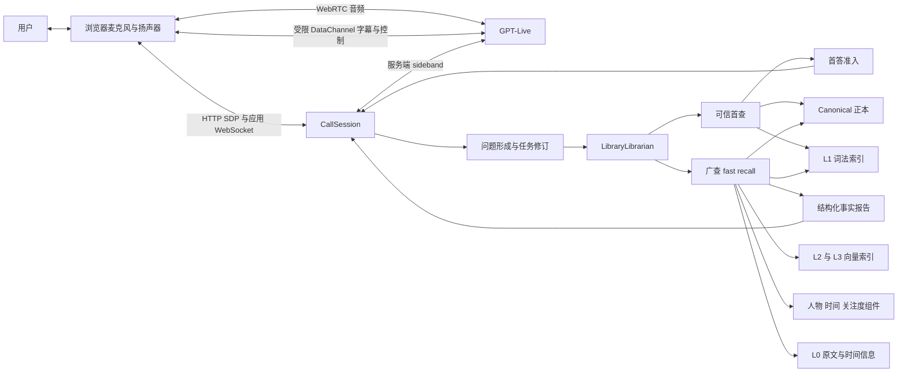
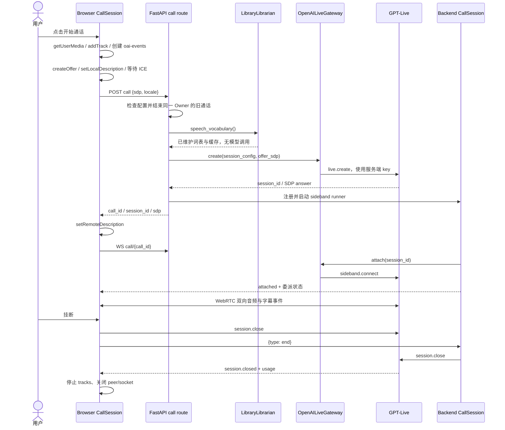
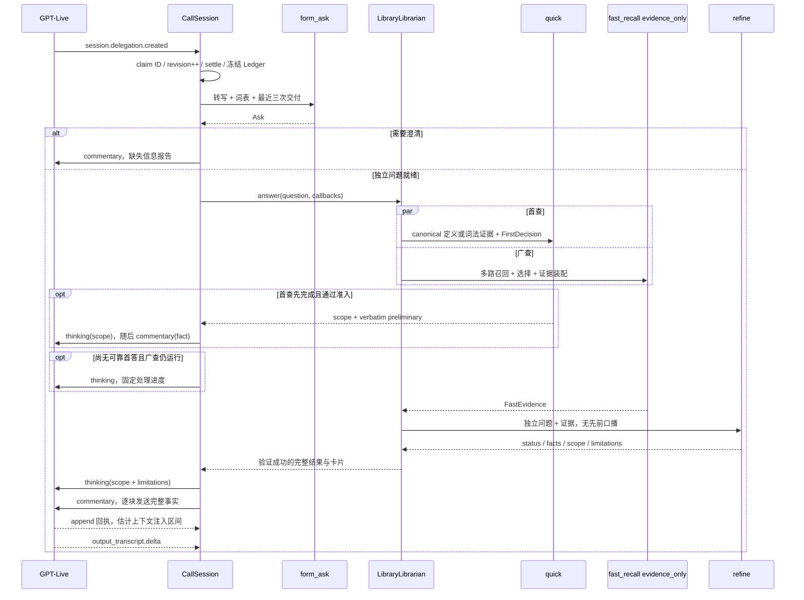
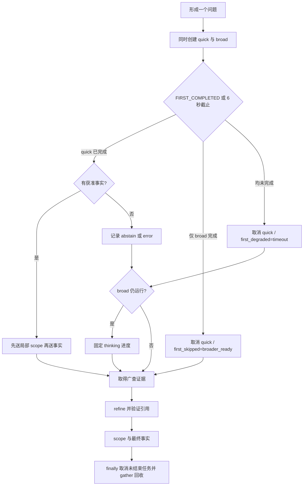
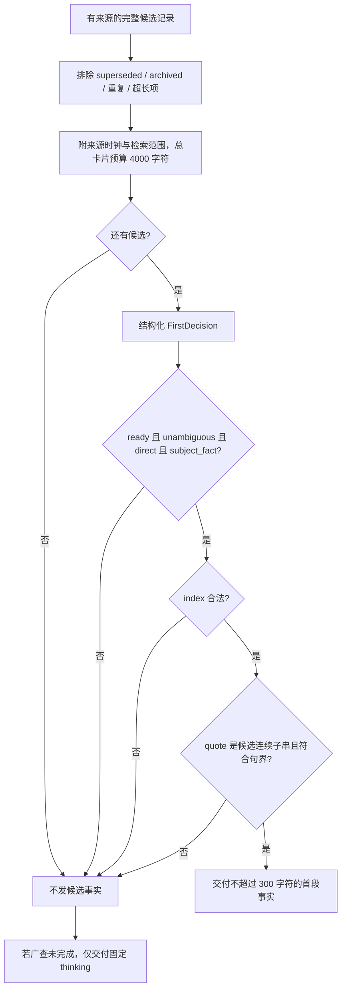
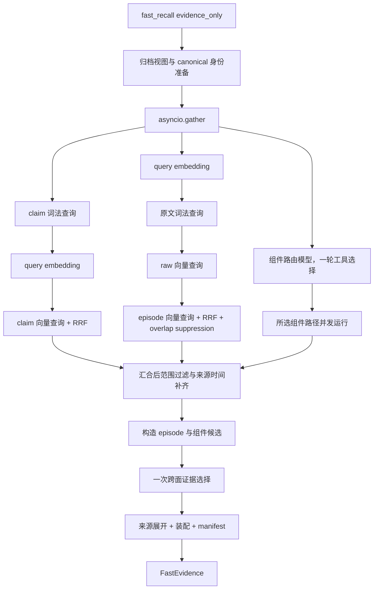
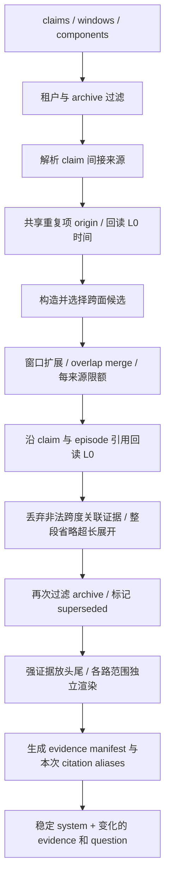
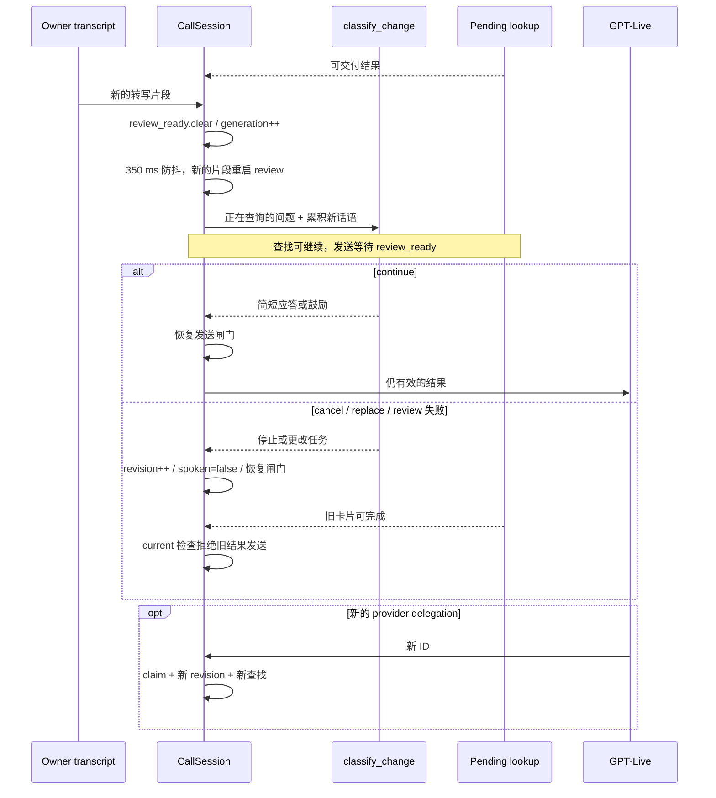
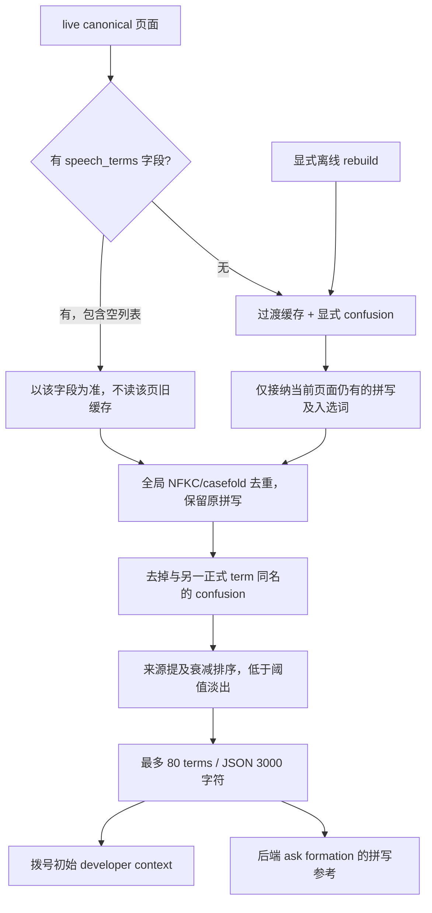

# 语音模式：架构设计与详细实现

[English](voice-call-implementation.md) | **简体中文**

实现参考日期：2026-09-22。语音基线为 `630896abaef9a4eb64ffcaf6be8d7102fb782063`；来源时钟策略与准入的新增行为见[证据评分](evidence-scoring.zh-CN.md)。
本文完整展开通话入口、双工会话、问题形成、多级检索、证据融合、渐进交付、词表、性能与观测；阅读正文不需要先读其他文档。参数是该版本的默认值或明确的语音覆盖值，不代表所有部署的实时配置。示例均为合成数据。

## 1. 设计目标与边界

用户可以连续说话、追问、补充条件、纠正名字和打断回答。系统既要理解“刚才第二点”这样的指代，也要从知识库返回可追溯的事实。优先级是：主体和所问维度正确、限定完整，然后才是更早交付。

系统有三个不同的完成条件：后端已经查到、信息已经进入语音模型上下文、用户已经听到。它们不能互相替代。“我查一下”也不能算首个有用答案。

语音查库使用固定的 fast recall 工作流。它不是独立的多轮自主 agent，也没有自动升级 deep recall、联网搜索或写入知识库的流程。通话不产生 compile、draft 或 Owner statement；字幕不是自动入库的源材料。项目另有 Live Context 功能，不能把它的网页搜索、规划与建议卡流水线当作本通话的实现。

## 2. 总体架构



| 层 | 职责 | 不掌握或不负责的内容 |
|---|---|---|
| GPT-Live | 听说、接话、澄清、决定委派、解释结果、处理语音打断 | 不直接访问私有知识库索引 |
| 浏览器 | WebRTC、字幕、静音、挂断、证据卡与诊断导出 | 不持有项目 API key，不向模型注入知识或指令 |
| `CallSession` | 转写账本、委派去重、revision、时限、交付类型、回执 | 不自行判断候选证据的语义正确性 |
| `LibraryLibrarian` | 形成独立问题、并行首查/广查、组织事实报告 | 不知道用户实际听到了哪一句 |
| core recall | 融合、筛选、来源展开、引用准入、结构化综合 | 不依赖具体 HTTP/数据库客户端 |
| service adapters | Meilisearch、Qdrant、Postgres、Git、模型与评分器连接 | 不创建新的知识权威 |

音频主链路直接连接浏览器与供应商。后端 sideband 会收到音频事件副本，但网关在事件序列化前丢弃 `session.output_audio.delta` 和 `session.input_audio.append`；它不在音频必经路径上，也不执行自建 ASR→文本 LLM→TTS 串联。

会话使用 client delegation，后端模型可独立选择。Live 的 `CALL_MODEL` 默认 `gpt-live-1`，`CALL_VOICE` 默认 `marin`；文本辅助角色是另一个配置 `LLM_MODEL_CALL`，未指定时借用 recall/default 模型。wiring 对 `call` 角色固定 reasoning effort 为 `none`；不是把所有检索都交给语音模型。

## 3. 知识底座与四级访问

| 级别 | 内容与存储 | 语音用途 |
|---|---|---|
| L0 | Postgres 原文块、结构、对齐的来源时间；原始媒体在私有对象存储 | 校验并回读确切来源区间，补充时间与归属 |
| L1 | Meilisearch 原文词法索引，以及 canonical claim 的词法投影 | 精确名称、关键字、未编译材料的召回 |
| L2 | Qdrant 原文 raw 向量与 episode 标题/描述向量 | 同义表达与主题召回 |
| L3 | Git canonical 文档、overview、带 anchor 的 claims；配套词法/向量投影 | 定义、决策、状态、跨材料整理的事实 |

这四级是同一来源的不同访问面，不是 L3 失败再退到 L2、L1、L0 的阶梯。L0/L1 不依赖材料是否进行语义索引或 canonical 编译。权威是 L0 和 canonical；索引、词表缓存、组件投影均可重建。episode 分段/描述的 manifest 是保留的生成记录，重建重放其结果。

每个来源共享地址 `source_id + block_start + block_end`，闭区间写成 `[cite: source-id ¶a-b]`。canonical 的引用可以经过其他 claim；召回解析同一 provenance 图，最终落到源区间。语音默认只传文字/caption，不拉原始图片给模型。

L2 在入库时建立两种独立表示：raw 保留原文，episode 用派生标题/描述提高可检索性。语义片段可在相邻主题边界有限重叠；原文块不改写。搜索时两种表示独立排名，最终仍回到 L0 地址；派生摘要不能被当成原文或另一套事实权威。

## 4. 拨号、连接与退出



浏览器请求 echo cancellation、noise suppression、automatic gain control；是否以及如何生效由浏览器/设备实现。DataChannel 必须先于 SDP offer 创建，监听器先于连接完成安装，防止丢掉刚接通时的事件。ICE 最长等 10 秒，超时用已收集候选继续协商，并非直接报错。

| API | 输入/输出 | 语义 |
|---|---|---|
| `GET /v1/users/{uid}/call` | `configured, reason, detail, model, voice, live` | 可用性检查，不拨号 |
| `POST /v1/users/{uid}/call` | 输入 `sdp, locale?`；201 返回 `call_id, session_id, sdp, expires_at:null` | 真正创建会话；缺配置 503，供应商创建失败 502 |
| `WS /v1/users/{uid}/call/{call_id}` | 输出 `attached, delegation, usage, error, closed, ping`；接收 `end` | 应用状态与挂断，非音频通道 |

应用 WS 核对会话的 `user_id`，错误 ID 返回 `unknown_call`。实际身份认证仍由部署入口负责，路径里出现 tenant ID 本身不是身份验证。

供应商配置只允许浏览器发送 `session.close`、`session.input_audio.mute`、`session.input_audio.unmute`，不是仅靠前端约定。静音 UI 等待供应商确认事件，点击不立即伪造“已静音”。`locale` 在此版本请求模型中存在，但 route 未拿它动态选择语音 prompt；prompt 语言来自部署的 catalog/overlay。

后端每秒检查会话期限：Owner 无新转写 180 秒自动结束，总时长默认 1,800 秒；设 0 可关闭对应限制。应用 WS 无订阅者累计 20 秒结束 orphan 通话；每 30 秒发 ping。浏览器正常挂断等待结束事件，15 秒兜底释放媒体；页面卸载则尽力发双路关闭后立即清理。服务退出关闭注册会话，sideband 丢失会结束应用侧通话状态。

注册表与转写位于 API 进程内存中；按 Owner 替换旧通话的策略也只在单进程内执行，不能直接扩展成多副本全局锁。重新连接应用 WS 可补发当前卡片，不能恢复进程重启前的 Live 会话。桌面托盘只打开 `/#/steward?call=1` 的浏览器入口，该 URL 只准备界面，不能自动触发计费通话。

## 5. 对话上下文：从转写到独立检索问题

### 5.1 转写账本与冻结

`Ledger` 保存 `Fragment(speaker, text, start_ms, end_ms)`，逐字连接 delta，不擅自补空格或去掉重复词。两位说话者独立归组，同一人片段间隔大于 1,200 ms 才开新行；“嗯”不会拆开另一个人的句子。分组只是显示/上下文单元，不宣称真实轮次结束。

供应商委派事件给出 ID、target 与 offset，没有完整 question。后端先等待 Owner 转写静默 350 ms，最长等到委派后 1.2 秒；不是在音频上再做一套 VAD。随后在任何词表 I/O 之前复制账本，保证异步等待期间新话语不会改掉旧卡片的问题。

问题形成读取：

1. 最近转写，目标预算 1,800 字符；按完整行保留，最新单行可超过这个预算。
2. 最近三条有 `ask` 和 `said` 的委派，`said` 明确表示交给 Live 的文本，不表示播放完毕。
3. 当前 canonical 标题候选，按与原始听到内容的 token 重合数稳定排序，标题文字预算 2,400 字符，列表符号为额外开销。
4. 语音专名词表。它与标题列表拼接，因此不是整个输入严格限于 2,400 字符。

`form_ask()` 使用字节稳定的 SystemMessage，变化的词表、历史和转写放 HumanMessage，转写在末尾。输出 `AskDecision(ready, question, clarify)`。它解析“它”“第二点”，应用最新纠正，只有上下文支持才修复名字；不增加用户没有问的范围。相对日期原样保留给后续携带时钟的检索。

明确但词表里没有的名字仍然可检索；“最近做了哪些项目”也不应要求用户先提供项目清单。真正缺主体或指代无法解析时返回 missing-information 报告，由 Live 自己组织澄清问句。问题形成默认 6 秒超时，失败退回 Owner 最近原话，记录 degraded；这保留了可用性，但“第二点”这样的回退可能检索很差。

### 5.2 一次委派的端到端时序



## 6. 两阶段调度与可信首答

### 6.1 并发调度规则

每个成形问题都创建 `quick_task` 和 `broad_task`。二者共享 resolved tenant、`as_of`、canonical 文档集合和归档策略；各自读实时索引，这不是跨数据库事务快照。



如果两个任务同时已完成，代码优先处理 quick 的完成结果。广查先完成时不再为了首答等满 6 秒；这可能放弃一条即将完成的局部事实，换取更早开始最终综合。首查失败不取消广查。关闭或整次查询取消时，两条支路都要取消并回收。

### 6.2 首查取证：标题优先，然后才可能词法查询

`canonical_first_claims()` 对 question、title、slug 做 NFKC、casefold、空白/下划线/连字符规范化。检测完整名称的出现，长度至少 3 字符，拉丁字母/数字有边界条件；不做模糊实体猜测。标题身份优先于共享 slug。

- 唯一页面匹配：只取该页 overview 的 `definition`、`summary`，definition 优先；解析其来源引用，缺引用、missing/ambiguous anchor 不准入。
- 多主体、重复身份或匹配页没有合格 overview：返回空候选，等广查；不退去其他页面找碰巧提到这个名字的句子。
- 完全没有页面匹配：才运行受限词法 fast recall。

词法首查关闭 embeddings、向量、组件路由、JEV scorer、glance 与普通回答生成，使用 `evidence_only=True`。候选 claim 8、保留 6；原文窗口候选 3、保留 2；episode 0；claim 来源展开最多 6 段。之后只做一次 `FirstDecision` 模型判断，没有再写一次摘要的模型调用。

### 6.3 首答准入活动图



完整候选经过 `speakable()` 去引用/格式后参与精确复制检查；因此这里的“逐字”指展示给选择器的规范化候选文本，不是源文件字节级摘录。候选最多 8 条，每条最多 6,000 UTF-8 bytes；带 metadata 的全部候选卡片最多 4,000 字符，超限整条跳过，不裁掉记录末尾的限制条件。

`FirstDecision` 的字段为 `disposition`、`index`、`subject`、`support`、`record_kind`、`quote`。只有 `ready + unambiguous + direct + subject_fact` 可进入下一步。代码校验合法索引、最大 300 字符、连续子串、前后句界；不允许重写定义、拼接非连续句子或只截取子句。句界判断是标点启发式，并不是完整语言学分析。

| FirstDecision 字段 | 允许值/约束 |
|---|---|
| `disposition` | `ready` / `needs_review` / `no_answer` |
| `index` | 整数，默认 -1；实际使用须落在本次候选范围内 |
| `subject` | `unambiguous` / `ambiguous` / `unknown` |
| `support` | `direct` / `indirect` / `none` |
| `record_kind` | `subject_fact` / `test_or_usage_instruction` / `question_or_hypothesis` / `other` |
| `quote` | 默认空，最多 300 字符，获准时须满足连续复制与句界检查 |

模型仍负责判断主体、相关性和句外限定的重要性。枚举字段和复制检查可以机械拒绝不合规结果，不能证明模型把一段资料理解对了。“非常自信”在这里落实为多条件准入，不是一个经过校准的概率阈值。

合成反例：资料写“测试时问『Lyrra 是什么』，应先显示速览卡，再升级完整卡”。它描述测试 UI，不能得出“Lyrra 是一个逐步升级卡片的系统”。必须判作 `test_or_usage_instruction`，不能先播报这种解释；也不能把这段猜测塞进 thinking，因为 thinking 仍可能影响后续发言。

## 7. 广查的多路召回与评分

### 7.1 实际并发边界



外层三个分支并发；内部 claim 的 lexical→embedding→vector 顺序 await，原文分支的 embedding→lexical→raw vector→episode vector 也是顺序 await。同一个问题通常会在 claim 和原文分支各 embedding 一次，当前调用没有共享 query vector；底层函数接受预计算向量，但不能把这个能力写成语音已实现的复用。

如果关闭 semantic retrieval，L1/L3 词法仍可工作；L2 raw/episode 与语义摘要分支跳过。主索引错误不应概括成“所有分支均可独立降级”：组件、选择器有明确 fail-soft，主 retrieval gather 的异常可能使本次广查失败。

### 7.2 排名融合和去重

RRF 按排名而非不同数据库的原始分数融合：`score(x) = Σ 1 / (60 + rank_i(x))`，代码的 rank 从 0 开始。claim 与原文不混成一个 RRF 榜，而是各自内部融合，再交给统一证据选择。

claim 以 `(document_path, anchor)` 为键，词法与向量命中合并路径标签；再按文本相等/包含关系去重，较完整文本保留在更靠前的位置，最后截取 candidate cap。默认候选深度 80，语音没有把它缩成最终输出的 12。

原文三路以 `(source_id, block_start, block_end)` 为键。各路先取请求数量的 2 倍，再融合、消除重叠、截取窗口候选数，避免同一片段的多种表示吃光名额。广查默认 window candidate cap 为 60，所以每个底层原文检索面可请求 120 条，最后的融合候选最多 60 条。

完全相同跨度累加 RRF 信号；仅重叠的跨度做贪心抑制，不合并成跨主题巨型区间。raw 原文优先于 lexical 单块，二者优先于仅 episode 的派生表示；保留获胜区间和文本，分数取两者最大值，不再相加，汇总路径与 episode 信号。

### 7.3 组件路径

有启用组件时，一次 route 模型调用选择至多 4 个路径调用并校验 Pydantic 参数；随后 `run_paths()` 并发执行。路由默认 10 秒，每路径默认 15 秒，均受整个委派 30 秒外层时限约束。没有路径就没有路由调用。

| 路径 | 作用 | 路径声明 cap |
|---|---|---:|
| `person(alias, identity)` | 名字、别称或身份对应的人物事实 | 24 |
| `people_around(subject)` | 与项目/团队/主题有关的人及关系 | 24 |
| `timespan(since, until, about)` | Owner 日历日期内的来源区间与引用这些来源的 claims | 12 |
| `attention(limit)` | 被既有咨询使用的热点 claims，表示关注度而非实体相关性 | 12 |

路径返回结构化查找结果，不是另一个相似度榜，不进入 RRF。框架按问题相关性排序，再应用路径 cap、总计默认 6,000 字符预算和双向去重。已在普通面显示的内容不重复铺开，保留 `via:<path>`、参数和 omitted/dropped 记录。进入 `select` 后，组件项作为独立候选一起受选择；被选中才移入普通 claim/window 面，原位置保留查找回执。

当前 `timespan` **确实有** `about` 主体过滤：名字 token 全部须出现在 NFKC/casefold 的文本中；命中块向前后各保留 2 块，受时间区间边界限制，相邻区间合并。空 `about` 返回该期间材料。时间块查询还有 5,000 行存储读取上限，宽范围不是无限枚举。日期参数严格 `YYYY-MM-DD`，相对日期由 route 结合 `as_of`、Owner 时区转换。claims 的时间纳入依赖其引用来源出现在期间来源集合中，不证明每条 claim 描述的事件本身就在此期间。独立词法/向量路不继承 timespan 的日期过滤，必须保留各路范围供综合判断。

### 7.4 一次跨面选择

语音覆盖策略为 `select`。配置模型选择器时，结构化返回各面的坐标；配置 scorer 时，继承部署的 TypeSafe/JEV 实现。统一候选包括 claims、episode summaries、windows、component items。语音关闭 glance，因此不例行把全库目录和整页选择带入上下文。

JEV 分数是四级有用性 rubric 的期望级别除以 3，得到 0–1：无关、同主体但不回答、有用的部分证据、直接回答。默认 keep floor 0.5。它衡量对当前问题的用处，不是事实真值概率或首答置信度。

一个逻辑评分 pass 可包含多个 HTTP 请求：每片默认最多 50 项、24,000 个序列化候选字符，并发 16。单个超长候选可以单独成片，故字符值不是完整 HTTP body 的绝对上限。候选正文超过 1,500 字符时保留约 2/3 头部、1/3 尾部并标明中段截断；来源/时间 metadata 另计。候选使用 `c1` 等命名键，避免模型靠数组位置计数。

评分适配器单请求超时 6 秒，对 429/5xx/网络异常最多重试一次，最小间隔 250 ms，并尊重 `Retry-After`。冷却时间达到请求超时时，分片直接标为未评分；语音外层 selection timeout 是 5 秒，可能先取消整轮。HTTP client 复用连接。失败分片与异常分数标作 unscored，不能当成 0 分；全部失败走 ranked fallback。scorer 输入 token 独立记账，不混入聊天模型 token 用量。缓存适配器的十六个并发槽位由同时发生的多次评分共享。

只读问题的 Noul 与 Choice 放在同一次请求里，与检索并行，最长两秒；首查和广查共享该任务。Noul 概率 0.8 识别来源时间意图，Choice confidence 0.7 采纳受支持的日历区间，再由 core 按 Owner 时区计算边界。筛选前和组装后都执行确切来源时钟检查，排除区间外或时间不明的证据，把混合逐字窗口拆成有界的连续块；排名兜底不能带回被排除记录。请求区间不受支持时返回未确定，校验服务不可用时返回另一种失败结果，不要求用户重述日期。无合格证据时不发送首条事实，也不调用最终回答模型。否定时间意图保持原评分输入；未配置策略保持既有通道。精简日期关系跟随准入来源时钟，明确区分事件日期。概率分布与 confidence 仍只是诊断，不新增相关性置信度过滤；有界阶段预览包含策略/区间判断、聚合与数字样本，不是完整持久评分日志。设计与测量见[证据评分](evidence-scoring.zh-CN.md)。

筛选后仍有 ranked anchors：先放选中项，再补排名头部，最多补入 claims 8、episodes 4、windows 4，并受各面 cap 约束；组件不补 anchors。语音 episode cap 只有 3，实际不可能补到 4。因此最终上下文不等于“全都被 JEV 判为相关”；低分或未评分的头部可能因 anchors 存在。selection 超时/异常时普通面回到 ranked heads，组件 fallback 仍受自身预算，不会凭空失去范围标签。

## 8. 上下文融合与证据装配



“融合”不只是把多份文本拼接。每项保留三组元数据：证据自身地址、检索来源、来源时间。

- `RetrievalOrigin(route, method, arguments, bounded)`：谁查到、怎么查、传了哪些过滤。仅完全相同的证据共享多个 origin；含有或重叠不意味着同一范围。
- `EvidenceTime(source_id, span, occurred_on, first, last, timed_blocks)`：来源发生时间、块级最早/最晚时间和时间覆盖块数。缺日期保留 unknown，不用入库时间替代。
- source title、section breadcrumb、canonical path/anchor 和 current/superseded/archive 标签：帮助区别同名、历史状态和材料种类。

`CachedSources` 在单次 `fast_recall` 内按 source ID 缓存 asyncio Task，并检查 tenant；同一源的并发消费者复用在途读取。`enrich_evidence()` 对不同来源最多并发 8 个读取，校验返回 source/tenant 身份。缓存不跨首查和广查，不跨所有问题；组件内部也可能使用自己的读取和缓存。

普通窗口默认只对 lexical-only hit 向后扩展 1 块，扩展目标预算 700 字符；它按整块添加，单个块可越过这个目标。raw/episode 已有自然边界，`bounded` 结构化路径也不扩展。只合并真实重叠且 origin 相同的窗口，不补未检索的桥接块；每来源默认留 3 段。普通装配窗口最多保留 2,500 字符头部并标注截断，地址仍指向原跨度：**地址完整不等于内容已经完整展示**。

进一步沿选中的 claim 回读最多 4 段来源、episode 回读最多 1 段；引用范围校验失败会剔除关联 claim/summary 并记录 `provenance:invalid_span`。展开段超过 6,000 字符时整段省略，保留已验证引用的 claim，记录 `provenance:oversized_passage_omitted`。这与普通窗口的截断策略不同，也意味着模型不总能看到所有引用原文。

最终将强证据交替置于头尾、弱证据置于中部，这是固定的 long-context ordering 策略，没有再调一次模型。相同证据不重复显示为多个面；空查找、失败或未选中仍保留范围回执。`superseded` 在广查里可作为标记过的历史，首查则排除；archive 默认在索引、装配和后续展开处过滤。

通话不例行启用全库 glance、query planning、额外 reranker、timeline expansion 或 annotated-window 模式。保留 canonical documents 供身份/归档/来源解析使用，并不意味着把全库文档正文塞进 prompt。

## 9. 最终事实报告与引用准入

`FastEvidence` 是 fast recall 正常检索、选择、装配后的返回；`evidence_only=True` 在普通 answer 调用之前停止。语音随后执行一次 `refine()`，避免“普通回答→再改写成口播”的重复模型工作。

```json
{
  "status": "partial",
  "facts": [
    {"text": "截至 2026-09-10，Lyrra 的记录版本为 0.4。", "citations": ["[cite: s01 ¶8-9]"]}
  ],
  "scope": "一条带日期的版本记录。",
  "limitations": ["没有证据证明它仍是当前最新版本。"]
}
```

| 字段 | 约束 | 用途 |
|---|---|---|
| `status` | answered / partial / unresolved | 完成度，由模型判断 |
| `facts` | 最多 6 条，每条 text 最多 600 字符 | 独立可懂、保留限定的事实，必须带引用 |
| `scope` | 最多 300 字符 | 证据实际覆盖的主体、日期、范围 |
| `limitations` | 最多 4 条，每条最多 200 字符 | 所问但未建立的方面 |

综合只读取本次独立问题和证据，不接收先前口播、也不判断 retained/new。即使最终事实重复首答，也完整返回给 Live，由它根据自己的对话状态决定怎么说。`partial` 不应被说成全库完整答案；旧日期记录不能直接变成“最新版本”。

引用有两层准入：从已渲染上下文与 typed evidence manifest 的交集提取允许的 `(source, start, end)`；动态 Pydantic/Literal schema 只提供这些引用选项，解析后再检查一遍。`s01` 是本次问题的 alias，不跨问题复用。`[cite: s01]` 会展开为该 handle 已准入的确切跨度；不连续区间不会填成连续大段。

`answered/partial` 没有 facts、fact 没有 citations、未知 handle 或凭空跨度都会失败。`unresolved` 丢弃任何推测 facts，输出固定“目前记录不足以支持可靠答案”措辞；无可准入引用时直接走该分支。校验的是引用地址与可追溯性，不是自然语言蕴含；模型仍可能误读一条真实来源。

## 10. 向双工语音模型交付上下文

| 内容 | 事件 | 结果计数 |
|---|---|---|
| 局部范围、最终 scope/limitations、等待进度 | `session.thinking.append` | 不进入 `said` 或首结果延迟 |
| 获准首答、最终事实 | `session.commentary.append` | 进入 `said`，首条设置首结果时间 |
| 澄清缺失信息、查找失败/不完整通知 | `session.commentary.append`，`result=False` | 不是事实结果，不占结果预算 |
| 应用自己定义的行为控制 | API 支持 `session.instructions.append` | 常驻策略在创建会话时设置，当前检索发送器不把资料变成 instructions |

事件均沿用原始 provider delegation ID；一个委派可以接收多次 append。官方每次 append 上限 500 tokens，本实现用 420 字符和 480 UTF-8 bytes 双界限做保守约束，支持罕见汉字/emoji。长句尽量在词边界拆分；任何发送入口包括澄清都执行该限制。

`SpokenChunker` 清除 citation、Markdown 装饰和链接地址，保留可说的文字；中英文句末或换行触发可交付块，前后块最少 8 字符。小数、版本号中的点不轻易被当作句末；未闭合 `[` 不放出半个引用；冒号引出的列表头不单独释放，避免 Live 抢先补全尚未返回的列表。特别长的完整句子仍可能因字节限额拆开。

`_Attempt` 的 callbacks 不做 I/O，只入队。首答通过准入后立即排入 scope→preliminary；最终文本先缓冲，等 librarian 整体成功、schema/引用验证完成，再排入 scope→facts。失败不会泄漏已缓冲的半份最终报告。这是“完整结果分阶段流式交付”，不是把未经验证的 JSON token 实时读出去。

结果预算阈值为 `SPOKEN_BUDGET_CHARS=4000`；发送前检查当前 `said` 是否已达阈值，最后一块可能使其略超。正常 schema 的 6×600 字符事实加首答可容纳在这个级别。scope、进度、失败不消耗预算。9 秒仍没有结果且未发过进度时只发一次固定 thinking；已发送早期 checking 则不重复。

scope 与 facts 按顺序发送，但不等待前者 ACK 再发后者。ACK 表示估计上下文注入，不代表模型播报完成。thinking 是模型能使用的事实上下文，不是不可见推理区；不应塞入不可信候选、秘密或内部思维链。[官方事件语义](https://developers.openai.com/api/docs/guides/live-delegation#send-the-right-kind-of-update)

## 11. 打断、纠正与过期结果控制



`_claimed` 在任务启动前记录 provider ID，重复事件不会重复查库。新委派递增 session revision，旧任务即使完成也不能再说，但可保留屏幕结果。每次 `_hand_over()` 等待 review，并再次检查 revision 与 closing，不能只在检索启动时检查一次。

有活动问题时的新 Owner 转写先暂停发送，再做 350 ms 防抖的 `continue/cancel/replace` 判断。判断超时 3 秒或出错保守关闭旧任务后续发言并记录 unresolved。新片段会撤销上次 review，generation 防止旧判定覆盖新话语。

这并不是“用户发出任意声音就取消查找”。简短应答、鼓励继续、无关感叹不改变任务；明确不要查了或纠正主题/日期才使结果失效。replace 本身不自动启动另一个检索，仍由新的 Live 委派驱动。该 review 主要覆盖已有 ask 且仍在 searching/answering 的阶段，不能把它理解成对整个通话所有意图变化的全局识别器。

已经进入供应商上下文的内容无法靠本地 revision 撤回；旧内容若已被读出，后续纠正需要 Live 清楚表达。应用无法凭回执判断用户听到了多少。停止讲话与取消后端任务是不同动作，Live 管前者，session 管后续结果有效性。

## 12. 语音词表：来源、维护与两处使用

### 12.1 设计定位

词表针对生造项目名、少见人名、中英混合词、易混缩写；普通高频词不因出现频繁就准入。这里不额外调用一个 ASR 服务，也不直接改写供应商原始字幕。

当前 `session_config` 把拼写参考放入初始 developer context 的 `<speech_vocabulary>` 段，帮助 Live 理解名称；后端 `form_ask()` 再读取词表和按当前话语排序的页面标题，修复查库问题里的名字。开场词表在该 Live 会话中保持不变；后续 ask 的文档视图可以按 TTL 刷新。这两个作用应分别测量，不能把“检索问题修对了”声称成“原始转写变对了”。

独立 Realtime transcription API 有 `keywords` 上下文配置，但本实现没有把那个接口字段移植到 GPT-Live WebRTC session；也没有实现 phonetic decoder 或 ASR 模型微调。[转写接口上下文](https://developers.openai.com/api/docs/guides/realtime-transcription#add-transcription-context)

### 12.2 canonical 元数据路径

```yaml
speech_terms: [{"term":"Lyrra","confusions":["leera"]},"洛芮"]
```

正常编译在 `create_document`、`set_fields`、`rewrite_overview(fields)` 的同一 draft/commit 内维护字段。它是单行 JSON 形式的合法 YAML。写入面与最终 gate 校验：list 最多 40 项；term 长度 2–80、规范化、唯一、禁控制字符与特定分隔符；必须在正文（含标题行）精确出现，拉丁 token 边界检查防止从长单词里切出假缩写。confusions 每项最多 6 个有界拼写。

只有 Owner 明确纠正才应维护 confusions，这是编译契约的语义要求；gate 校验形状和范围，不证明别名真的来自 Owner，也不证明识别困难或词表完整。改正文导致 term 不再出现时必须修 metadata，否则不能提交。读时合并本身不是写 gate 的替代。

### 12.3 历史页面的派生缓存

显式运维脚本 `scripts/ops/build_speech_lexicon.py USER [--dry-run] [--model MODEL] [--confusion 'Lyrra=leera']` 在拨号之外运行。读取 live canonical 页面全文，按 12,000 字符窗口、160 字符重叠扫描。结构化提取每窗最多 40 项，仅接纳实际出现在所给文本中的拼写，不接受模型自造发音或别名。

页面扫描默认并发 3、每页 180 秒；第二次跨页 curate 调用只可选择已经验证过的候选，每批最多 300、输出最多 80，多批先压缩再汇总，整体 curate 240 秒时限。risk 1/2/3 和跨页覆盖供优先级参考，不是 ASR 统计分数。

缓存位于 `ENGINE_DIR/derived/speech-lexicons/<sha256(user_id)>.json`；没有 engine dir 时在 canonical root 的父目录下，同样不进 canonical Git。保存 version、tenant、页面 digest、model/prompt recipe、term/risk/origin、selected terms、显式 confusion 与 failures。页面未变且提取 recipe 相同可复用；变更页重扫，失败保留旧项并记录失败供下次处理。用临时文件和 `os.replace` 原子替换。没有后台自动周期任务，编译批次后需要显式重跑历史缓存。



归档/删除页面不再贡献词。显式字段 `[]` 表示有意清空，不能退回旧缓存。缺缓存时只收 metadata，不偷偷把所有页面标题无筛选塞进开场词表。活动投影尚未准备时保留 maintained 优先级；准备后由来源活动分数排序，全局按原拼写去重；把同时是另一个正式 term 的 confusion 去掉。它没有解决所有多义映射：同一 confusion 指向多个 term 等情况仍需模型结合声音/主题澄清。

合并后最多 80 个词、JSON 3,000 字符，wrapper 说明另计；超过预算整项跳过。拨号时不跑提取或 curate 模型，词表读取失败只失去增强，不使通话不可用。官方提示建议保留语言、发音与澄清策略，但没有提供本项目词表的效果保证。[Live 提示指南](https://developers.openai.com/api/docs/guides/live-prompting)

### 12.4 来源活动排序与淡出

编译仍负责选择 `speech_terms`。活动投影只排序已经入选的拼写，不重新按频次截断候选，不调用 JEV 或其他模型。编译维护的元数据独立决定入选资格；历史过渡缓存则保留衰减前按原有顺序和预算得到的入选范围，淡出腾出的空位不回填原先未进入通话的历史提示词，以免引入新的声音歧义。新的编译元数据仍可正常加入词条。`sync_projection` 在常规提交后增量准备；`rebuild_projection`（包括 `rebuild_derived` 的 L3 路径）从 canonical + L0 完整重建；显式历史词表预处理完成后也刷新活动投影。原子文件为同目录的 `<sha256(user_id)>.activity.json`，保存页面依赖摘要以及 term → source_id → 出现日期，既不是权威知识，也不是 kept record。

日期只来自页面 claim 引用范围内**实际出现该拼写**的原文块，使用公共 citation/provenance 投影和 `block_instants`，跨 claim 引用也遵循同一解析。块级时间不可用时，只接受来源已声明的 `occurred_on` 日期，不使用入库、编译或页面修改时间。日期按 UTC 日计算；未来日期不加分。有重复引用、重叠范围或多个页面时，同一词的同一来源只贡献一次，取截至当前日的最近出现日。

默认排序分数：`sum(min(3, 当日独立来源数) * 2 ** (-距今天数 / 60))`。半衰期 60 天；低于 0.25 分时退出通话提示，即使词表尚未满额。再次获得新来源提及时可重新进入，原始 `speech_terms` 和纠错信息始终保留。在上述入选边界内，排名先于最终 80 词/3,000 字符预算生效；否则只减分不退出，名额未满时就不会真正淡出。这些参数是明确的起始策略，不是经过 ASR 质量校准的阈值。

完全没有可靠日期的词保留 0.25 的低优先级候选资格；它们不会伪装成近期，也无法诚实地按年龄淡出。已有过期日期的词不能靠另一条无日期记录恢复。只有未来日期的词不进入。升级后尚未生成活动投影时保留原有词表顺序，下一次投影同步或显式 derived rebuild 才启用新排序。已知页面在 canonical 与活动投影之间发生变动时暂不提供该页提示，避免摘要失配把过期词当成无日期新词。

每次拨号仅在本地读取日期投影并计算分数，不扫描 L0、不发模型请求；既有 Live 会话的开场词表仍固定。没有后台定时任务，时间流逝在下一次读取时生效。相同依赖的页面复用日期；完整重建重读来源，重复重建既不加分，也不让旧词续命。来源读取失败保留先前完整文件并记日志，不使已经提交的知识投影失败；下一次同步或重建重试。缺失的历史 citation 保持日期未知，不能发明时间。用户、页面和来源身份检查保持隔离。Owner 更正只有作为普通 `owner-dialogue/v1` 来源导入、被编译引用且实际含该词时才提供新的日期；当前未从实时语音转写或 consultation 自动累加使用次数。

## 13. 延迟与成本优化清单

| 已实现手段 | 节省在哪里 | 代价/边界 |
|---|---|---|
| WebRTC 音频直达供应商 | 后端不串行转发/编解码主音频 | 仍受网络、设备、供应商影响 |
| 连接与模型实例复用 | 避免每个委派重新建 client | 无跨进程全局复用保证 |
| canonical 预热与 60 秒 TTL | 后续问题少读 Git 树 | 新编译结果可能等 TTL；非原子快照 |
| 首查/广查并发 | 明确短事实可先到 | 多做一次小判断，并非每题更快 |
| 广查 ready 就取消未完成首查 | 不被 6 秒首查时限拖住 | 可能放弃临近完成的首答 |
| 首查禁用 JEV、embedding、routing | 不重复昂贵广查流程 | 只能用有限 canonical/lexical 证据 |
| claim/window/component 并发 | 墙钟取较慢分支而非求和 | 各分支内部仍有串行 await |
| JEV 分片并发与连接池 | 一批候选同时评分 | 分片/重试仍受 selection 外层 5 秒限时 |
| 同次 L0 Task 缓存与 8 路补时钟 | 避免重复源回读 | 首查、广查、组件未全部共用一个缓存 |
| 不渲染全库 glance | 减小 prompt 和整页读取判断 | 失去全库目录提示；canonical 范围信息仍在 |
| 禁 planning / 额外 reranker | 减少顺序模型调用 | 没有多 query 扩召回及后置重排收益 |
| 候选广、交付小 | 保留检索面覆盖，又控制综合长度 | 小预算仍可能排掉重要证据 |
| 来源展开数量和长度有界 | 防止长 agent-session 拖慢综合 | 省略必须被解释，不等于完整覆盖 |
| 词表在编译/显式预处理时维护 | 拨号不花提取模型时间 | 老页面需维护，Live 开场词表不热更新 |
| 完整句/事实分块返回 | Live 不必等所有后续阶段 | 每块仍可能被转述或重复 |
| 复用仍有效的会话结果 | 复述、解释不必重新查库 | 是否委派仍依赖 Live 判断 |
| 不在原始 ASR 上投机跑另一套检索 | 避免两份竞争问题重复查库 | 需先付问题形成延迟 |

阶段近似：`T广查证据 ≈ T准备 + max(Tclaim, Twindow, Troute+Tpaths) + T选择 + T装配`。最终交付还要加 settle、词表/问题形成、refine、队列和 revision review；用户实际听到还要算供应商调度与音频播放。完整任务总体不等于所有阶段数字相加，因为有重叠。

正常一题的模型工作是：一次 ask、至多一次 first admission、可选一次 route、一次跨面 selector（或一组 scorer 请求）、一次 refine。新增 Owner 话语可额外触发 change classifier。没有候选/没有来源地址时相应调用会省略。当前取消中的模型调用可能已消耗供应商费用，payload 不一定有其最终 token 收据。

## 14. 关键参数总表

| 范围 | 名称 | 当前值/规则 |
|---|---|---|
| 会话 | idle / max / orphan | 180 s / 1800 s / 20 s |
| 建连/关闭 | ICE / browser close fallback | 10 s / 15 s |
| 转写 | row gap / settle quiet / settle max | 1200 ms / 350 ms / 1.2 s |
| 问题形成 | tail / title vocabulary / earlier / timeout | 1800 chars 软预算 / 2400 title chars / 3 / 6 s |
| 文档 | `DOCUMENTS_TTL_SECONDS` | 60 s，每个 librarian 实例 |
| 委派 | total timeout / holding progress | 30 s / 9 s |
| 修订 | review debounce / classify timeout | 350 ms / 3 s |
| 首查 | deadline / candidate records / quote | 6 s / 8 / 300 chars |
| 首查上下文 | per record / all cards | 6000 UTF-8 bytes / 4000 chars |
| 首查池 | claim candidate/keep，window candidate/keep | 8/6，3/2；无 episode |
| 广查池 | claim / fused windows 默认候选 | 80 / 60；继承部署设置 |
| 广查保留 | 普通 claims / windows / episodes | 12 / 4 / 3；组件选择与来源展开可能另加内容 |
| 组件 | route calls / route timeout / path timeout / face chars | 4 / 10 s / 15 s / 6000 |
| 选择 | timeout / scorer floor | 5 s / 默认 0.5，floor 继承部署 |
| 来源展开 | claim / episode / max passage | 4 / 1 / 6000 chars |
| 交付 | per append / result threshold | 420 chars 且 480 bytes / 4000 chars |
| 最终 schema | facts / fact / scope / limitations | 6 / 600 chars / 300 chars / 4×200 chars |
| 词表 | per page / confusions / rendered terms / JSON chars | 40 / 6 / 80 / 3000 |

配置名中的 Python 小写字段在环境变量中使用 `PNEUMA_KNOWLEDGE_` 前缀，例如 `PNEUMA_KNOWLEDGE_CALL_IDLE_SECONDS`、`PNEUMA_KNOWLEDGE_LLM_MODEL_CALL`。`OPENAI_API_KEY` 与 `OPENROUTER_API_KEY` 使用无此前缀的专用名称。语音 `POSTURE` 常量会覆盖普通 recall 的部分配置；不能通过改普通 answer cap 就假定语音已改变。

## 15. 观测、字幕与诊断

`Delegation` 包含应用 id、provider id、revision、ask、state、spoken、said、preliminary、answer_phase、answer、detail、deliveries、elapsed_ms、timings、updates、observed_speech、owner_changes。应用 WS 对每个委派发送完整 frame，浏览器按 id upsert，不靠猜测增量 patch。

状态是 `hearing → searching → answering → done`，可终止为 `unclear` 或 `failed`。`spoken=false` 表示不再允许该任务继续发送，并不意味着先前没发出内容。`answer_phase` 跟踪 searching/preliminary/refinement；最终 card 仍可完成。

| 观测字段 | 正确解释 |
|---|---|
| `settled, asked, retrieved, completed` | 从委派开始计的后端单调时钟里程碑 |
| `first_words, first_sent, elapsed_ms` | 首个结果成功 send；名字里的 words 不是物理声音 |
| `updates` | 每次 append 的类型、阶段、原文、event_id、sending/sent/acknowledged/rejected/send_failed |
| ACK `start_ms/end_ms` | provider 会话时钟上的估计上下文注入区间 |
| `deliveries` | 仅结果 commentary 的 ACK 区间，用于字幕导航 |
| `observed_speech` | 同时收到的 Live 转写，按最近委派记录，非因果归属 |
| `progressive` | preliminary、locator、first_disposition/reason、degraded/skipped |
| `lookup_result` | 带 citations 的最终事实、状态、范围、限制 |
| `stages` | fast recall 各阶段 ran/skipped/degraded、ms 和有界 preview |

并行子阶段时长不能相加当总延迟；`first_lookup` 也包含等两个任务之一完成的时间，不只选择模型时间。recall 子计时从 lane 开始，委派计时从收到 delegation 开始，不能无换算地与 provider 时钟混用。

浏览器把 provider 字幕、engine 事件、本地生命周期折叠进纯 reducer。两方字幕独立归组；在结果注入边界后开新语音行，避免“我查一下”和答案共用标记。`captionMarks` 选时间上最近的更早 delivery 作证据卡导航；较长未关联语音以 24 字符阈值区分展示。这不证明每句有该卡支持。

UI 可导出 JSON 诊断，包括 append 原文与转写。默认会话对象不是持久化通话档案；外部分享前另行处理私人内容。费用展示按供应商 usage 秒数和前端常量估算，后端模型、评分器另计；界面估价不是完整账单。

## 16. 失败、降级与保证范围

| 情况 | 实际处理 |
|---|---|
| 词表缺失/加载失败 | 不带词表继续；不在拨号时临时提取 |
| form_ask 失败/超时 | 最近 Owner 原话 + degraded |
| 真正缺少查询信息 | clarification report，不启动双查 |
| 首答不自信/不合格式 | 不发候选事实；广查继续 |
| 首查超时或广查先完成 | 取消首查，分别标 timeout 或 broader_ready |
| 路由/组件超时 | 对应路径退化并保留记录 |
| selector 失败 | ranked fallback，保留证据预算和降级原因 |
| 引用无效或最终生成失败 | 不释放缓冲的最终事实 |
| 首答之后广查失败 | 明确报告广查未完成，首答仍是局部支持 |
| Owner 改变问题或 review 不确定 | 禁止旧任务继续发送 |
| provider 拒绝 append | 标 rejected；现有发送器不自动重发 |
| 挂断/查询取消 | 停止后续交付，取消并回收成对查找 |

机械保证包括 tenant 边界、ID 去重、revision 检查、预算、来源地址准入、逐字复制与枚举准入、归档过滤。语义分类、答案是否忠实、范围是否足够、Live 是否正确表达限制仍依赖模型与评估。检索范围内没找到，不等于全库不存在；引用存在，不等于每句话都正确。

已知限制还包括：多数据库非原子快照；60 秒 canonical 缓存；启用组件时才传 Owner 检索 zone，否则该 kwargs 为 UTC；关闭通话不提供播放完成证明；没有逐句语音事实验证；没有自动撤回已注入上下文；没有按 provider context pressure 自动压缩本地账本；没有跨进程会话持久化。当前版本的设计材料必须保留这些边界。

## 17. 验证方法与可复现实验

确定性测试负责机制，不负责给自然语音打质量分。现有覆盖点包括：路由权限与会话隔离、委派重复/替换、快慢双查竞争、首答 abstain、句界与 UTF-8 限额、最终失败不泄漏、quiet progress 不算答案、scope 先于事实、引用准入、词表 metadata/caches、旧任务抑制、关闭与超时。

真实模型验证至少分三层：

1. 固定证据重放：同样问题/候选比较首答误放率、首答放弃率、完整答案保留事实与限定情况。
2. 同音频复放：分别量化原始专名转写、后端 formed ask 的主体修复、最终答案相关性；不能混成一个 ASR 分数。
3. 完整双工通话：真实音频中的取消、日期纠正、主体改口、“第二点”、复述/展开、噪声与打断；对齐字幕、交付、实际输出音频及浏览器播放检查。

延迟单独统计 delegation→首个事实 send、ACK 注入、完整后端结果、首个可听事实；报告 p50/p95 和超时/abstain 比例，按直接事实、模糊实体、宽时间范围分组。成本分 Live 时长、文本模型 token、scorer token 和被取消请求。比较需要同一 harness、同样输入与配置；本文没有据此宣称质量或延迟提升百分比。

待验证的后续优化包括：共享 query embedding、支路内部更多并发、跨首查/广查的只读源缓存、更细的 anchors 策略与测得的准入置信度。它们不是当前实现。任何优化都应同时观测误首答和漏答，不能只优化更早发出一段话。

## 18. 核心代码索引

路径供拿到源码的读者核查；正文已经展开行为，不要求依赖这些文件补齐设计。

| 相对路径（相对仓库根） | 核心对象 |
|---|---|
| `apps/web/src/lib/callSession.ts` | start、ICE、mute/end、双通道与 teardown |
| `apps/web/src/lib/call.ts` | reducer、caption grouping、delivery navigation |
| `packages/pneuma-knowledge-service/src/pneuma_knowledge_service/api/routes/call.py` | GET/POST/WS、orphan、registry |
| `packages/pneuma-knowledge-service/src/pneuma_knowledge_service/call/gateway.py` | provider create/attach、音频副本丢弃 |
| `packages/pneuma-knowledge-service/src/pneuma_knowledge_service/call/session.py` | session_config、_lookup、_hand_over、_Attempt、revision |
| `packages/pneuma-knowledge-service/src/pneuma_knowledge_service/call/librarian.py` | POSTURE、缓存、quick/broad 调度 |
| `packages/pneuma-knowledge-core/src/pneuma_knowledge_core/recall/call.py` | Ledger、form_ask、SpokenChunker、task_change |
| `packages/pneuma-knowledge-core/src/pneuma_knowledge_core/recall/progressive.py` | canonical_first_claims、first_finding、refine |
| `packages/pneuma-knowledge-core/src/pneuma_knowledge_core/recall/fast.py` | FastEvidence、候选选择、来源展开、manifest |
| `packages/pneuma-knowledge-core/src/pneuma_knowledge_core/recall/rag.py` | RRF、三路原文召回、重叠抑制 |
| `packages/pneuma-knowledge-core/src/pneuma_knowledge_core/recall/assembly.py` | 窗口扩展、合并、排序 |
| `packages/pneuma-knowledge-core/src/pneuma_knowledge_core/recall/evidence_context.py` | CachedSources、origin、时间与范围渲染 |
| `packages/pneuma-knowledge-core/src/pneuma_knowledge_core/recall/paths.py` | route_paths、run_paths、组件去重/预算 |
| `packages/pneuma-knowledge-service/src/pneuma_knowledge_service/adapters/typesafe_scorer.py` | 分片、并发、rubric、重试 |
| `packages/pneuma-knowledge-core/src/pneuma_knowledge_core/recall/speech_lexicon.py` | 提取、维护字段校验、curate、render |
| `packages/pneuma-knowledge-service/src/pneuma_knowledge_service/call/speech_lexicon.py` | 词表缓存与合并 |
| `scripts/ops/build_speech_lexicon.py` | 显式词表预处理 |
| `packages/pneuma-knowledge-core/src/pneuma_knowledge_core/prompts/catalog.py` 与 `lang_zh.py` | 两种语言的语音、问题形成、首答、综合、变更、词表契约 |
| `personal/desktop/src-tauri/src/call.rs` | 桌面托盘入口 |

对应测试入口：core 的 `test_call_delegate.py`、`test_progressive_call.py`、`test_fast_recall.py`、`test_rag_recall.py`；service 的 `test_call_session.py`、`test_call_route.py`、`test_progressive_librarian.py`、`test_speech_lexicon.py`、`test_typesafe_scorer.py`；web 的 `apps/web/tests/call.test.mjs`。

## 19. 协议参考与阅读定位

本文以锁定版本的代码为实现事实，API 行为另外核对于 2026-09-21。官方 [Live 架构指南](https://developers.openai.com/api/docs/guides/live) 区分连续语音与后端任务；[client delegation 指南](https://developers.openai.com/api/docs/guides/live-delegation#client-delegation) 说明复用连接、稳定输入和完整有用结果的交付。本项目在其上增加知识库证据、首答准入、revision 和诊断机制。官方指南不证明本项目具体实现的准确率。
