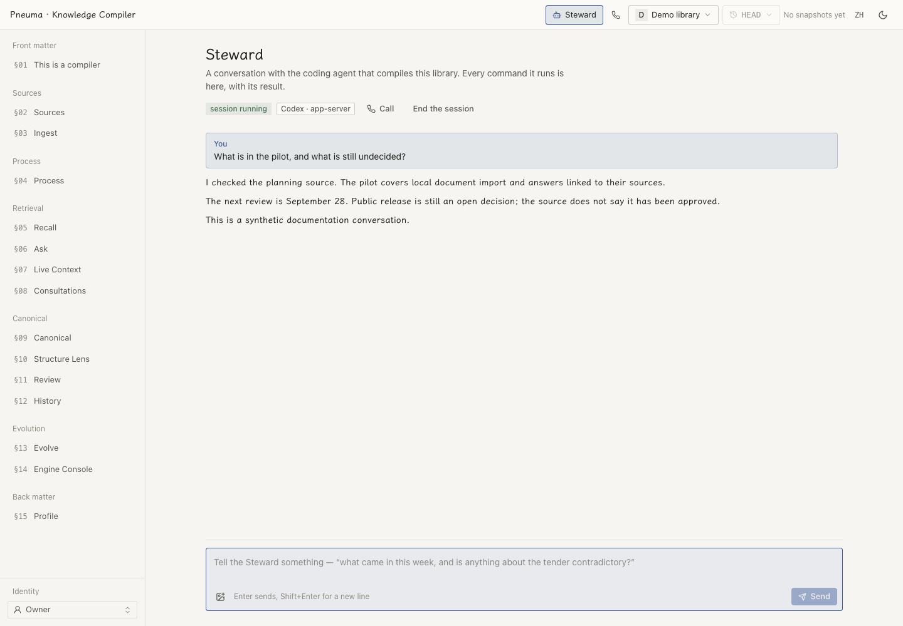

# PKC personal

**English** | [简体中文](README.zh-CN.md)

One person's knowledge libraries on one machine. `pkchome` manages a home directory, shared Docker middleware and separate libraries. A coding-agent Steward imports material and maintains cited claims through the framework's draft gate. The browser console and optional desktop tray provide the reading and operating interfaces.

## Install and open

Paste this instruction into your coding agent:

> Install the PKC personal edition: run `curl -fsSL https://raw.githubusercontent.com/pandazki/pneuma-knowledge-compiler/main/personal/install.sh | sh`, then follow the instructions it prints last.

The installer sets up `uv` when needed, the `pkchome` package and `pkc` launcher, the Steward skill, and the console assets. It checks that Docker is running. Re-running continues the installation; the script currently follows `main`, with `PKC_RELEASE=<ref>` selecting a different revision and `PKC_SOURCE=/path/to/checkout/personal` selecting local source.

After setup:

```sh
pkchome status
pkchome onboarding              # remaining profile and retrieval choices
pkchome up
pkchome console
pkchome tray                    # open an installed desktop app, or show its release page
```

Setup needs a terminal or `--answers answers.yaml`. It labels machine-inferred profile fields as inferred until you confirm them. The default contract is `personal-projects`; `personal-knowledge` and custom contracts remain available. Provider credentials depend on the compile/retrieval choices you make; a coding-agent subscription does not configure every model-backed browser feature.

## Use the library

The console offers source browsing, canonical pages with citations, compile history, retrieval, structural review and engine configuration. **Steward** is the coding-agent conversation: its replies, commands and optional image attachments stay visible in one place.

<picture>
  <source media="(prefers-color-scheme: dark)" srcset="../docs/assets/steward-en-dark.png">
  
</picture>

*Current UI, synthetic documentation conversation. No real account, agent execution or voice call was used to produce the screenshot. [Reproduce it](../docs/assets/README.md).*

**Call the library** is a separate voice feature in the same view and in the tray menu. It needs an OpenAI project key and a configured API recall model. The browser asks for microphone permission only when you start a call; opening its page does not start billing. Retrieval results appear alongside the conversation. The spelling reference comes from compiled terms, with source-date ranking and fade-out; it does not rewrite raw captions. See [voice behavior](../docs/design/voice-call.md) and [implementation](../docs/design/voice-call-implementation.md).

The [desktop tray](desktop/README.md) provides health, search, sync controls and settings. Install `PKC.app` in `~/Applications` or `/Applications` on macOS. Launch at login defaults on once; switching it off in Settings stays off. Quitting the tray leaves the engines running, but automatic session sync runs in the tray and stops with it.

## Choose and manage libraries

```sh
pkchome library create notes --language en --backend codex
pkchome library ls
pkchome library use notes
pkchome library bind notes /path/to/project
pkchome status --library notes
pkchome exec --library notes -- pkc jobs
```

Selection precedence is `--library`, `PKC_LIBRARY`, the nearest `.pkc` binding, then the home's current library. With no selection, commands refuse rather than guessing. `library create --from NAME` inherits another library's contract unless `--contract` overrides it.

| Operation | Command |
|---|---|
| Start, stop or restart engines and middleware | `pkchome up`, `pkchome down`, `pkchome restart` |
| Inspect or change a recorded choice | `pkchome config get KEY`, `pkchome config set KEY VALUE` |
| Store a credential without putting it in the command line | `pkchome credentials set KEY --from-stdin` |
| Install the Steward skill into a harness home | `pkchome skill install --backend codex` (or `claude-code`, `all`) |
| Refresh enabled component/consultation projections | `pkchome rebuild --library notes` |
| Open the console or download its assets | `pkchome console`, `pkchome console install` |

`down` preserves data. `rebuild` queues a `recall_rebuild` for enabled components and consultation projections; it does not recompile claims or replace the full framework index rebuild. `env --export` prints credentials for shell integration, so use `status` for shareable diagnostics. `register` and `forget` are placeholders, not working import/migration commands.

Each library enables the `time` component by default. `people` and `attention` are available in the framework but are not enabled by the personal edition's default configuration. [Components](../docs/design/index-components.md).

## Sync project sessions

Choose a narrow scope first and inspect the dry run:

```sh
pkchome watch add /path/to/project --library notes
pkchome watch ls --library notes
pkchome sync --library notes --dry-run
pkchome sync --library notes --json
```

`watch add ~/Projects --recursive` includes projects below a directory; `watch add --all` includes every discovered project. Remove a scope with `watch rm PATH` or `watch rm --all`. `sync roots ls` shows where Codex and Claude Code transcripts are read; `sync roots add DIR --harness codex|claude` registers an additional transcript root.

The tray checks for new material every 15 minutes by default. Settings controls sync and its interval. Each pending increment normally needs at least three Owner turns and 200 Owner-text characters; smaller increments stay **held** until enough material accumulates. These held sessions are separate from the library's job queue.

Only new portions are imported as `agent-session/v1` sources. Owner words and agent prose are retained; tool activity becomes bounded stubs. Tool arguments/results, reasoning, injected harness context and subagents are excluded. The library's own Steward rounds and configured excluded directories are skipped. A dry run writes no cursor, lock or journal. Rewritten/truncated sessions are reported and require explicit `--rewritten reingest` to import replacement material.

Sync imports and queues work; the ordinary worker compiles it. It does not write canonical files directly. The detailed rules, root discovery, thresholds and recovery behavior are in the [personal-edition design](../docs/design/single-machine-edition.md).

## When work is waiting

`pkchome status` separates queued work, retry waits, paused jobs and terminal failures. Provider or harness failures retry on a growing schedule, then pause. Fix the reported cause before resuming:

```sh
pkchome exec --library notes -- pkc jobs
pkchome exec --library notes -- pkc jobs resume --job JOB_ID
```

A paused job is not lost work. A dirty canonical tree is not automatically discarded: resolve your own uncommitted changes before resuming. For middleware recovery and full derived-index rebuilding, see [deployment operations](../docs/reference/deployment.md).

## Files, updates and development

```
~/.pkc/                         home; PKC_HOME selects another
  config.yaml                   infrastructure, defaults and sync preferences
  credentials                   private KEY=value file, mode 0600
  current                       default library selection
  infra/, run/, data/            compose, process state, logs and middleware data
  libraries/<name>/             library.yaml, engine/, canonical/ and skills
```

Harness skills install under `$CODEX_HOME/skills` (default `~/.codex/skills`) or `$CLAUDE_CONFIG_DIR/skills` (default `~/.claude/skills`). Unattended rounds receive their library's generated package in an isolated harness home. The installer removes only legacy global skill copies carrying this edition's marker.

The console is a built artifact. An engine reads the wheel's bundled page, a development `PKC_CONSOLE_DIST`, or the verified downloaded release under the home. If the assets are installed after an engine starts, run `pkchome restart` to serve them. [Console build/release scripts](../scripts/personal_console_dist.sh).

From the repository root:

```sh
uv run --project personal pytest personal/tests -q
PKC_SOURCE="$PWD/personal" sh personal/install.sh
```

`personal/` is a standalone uv project with its own environment and lockfile. Desktop development has separate [build instructions](desktop/README.md). To uninstall the package, first run `pkchome down`, then `uv tool uninstall pkc-personal`; the home and libraries remain until you explicitly remove them.
