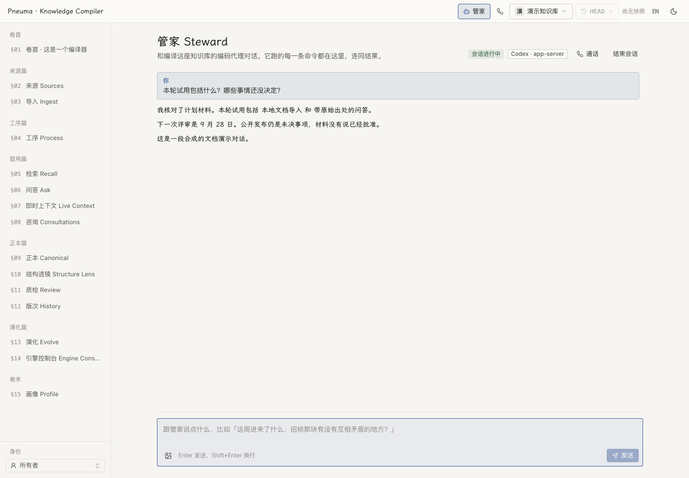

# PKC 个人版

[English](README.md) | **简体中文**

在一台机器上管理一个人的多座知识库。`pkchome` 管理 home 目录、共享 Docker 中间件和各个独立知识库；coding-agent Steward 通过框架的草稿闸门导入材料、维护带引用的主张。浏览器控制台和可选桌面托盘提供阅读与操作界面。

## 安装并打开

把这句话交给 coding agent：

> 安装 PKC 个人版：运行 `curl -fsSL https://raw.githubusercontent.com/pandazki/pneuma-knowledge-compiler/main/personal/install.sh | sh`，然后按最后打印的说明继续。

安装器按需安装 `uv`、`pkchome` 包与 `pkc` 启动器、Steward skill 和控制台资源，并检查 Docker 是否运行。重复执行可以继续安装；脚本目前默认跟随 `main`，用 `PKC_RELEASE=<ref>` 选择其他版本，或用 `PKC_SOURCE=/path/to/checkout/personal` 从本地源码安装。

设置完成后：

```sh
pkchome status
pkchome onboarding              # 尚待确认的个人信息和检索选择
pkchome up
pkchome console
pkchome tray                    # 打开已安装的桌面应用；未安装时给出发布页
```

设置需要终端或 `--answers answers.yaml`。机器推断出的个人信息会标为 inferred，直到你确认。默认契约是 `personal-projects`，也可选择 `personal-knowledge` 或自定义契约。所需凭据取决于编译与检索配置；coding-agent 订阅并不会自动配置所有依赖模型的浏览器功能。

## 使用知识库

控制台提供原文浏览、带引用的正本页面、编译历史、检索、结构检查和引擎设置。**Steward** 是 coding-agent 对话页，回复、执行命令和可选图片附件都在同一处可见。

<picture>
  <source media="(prefers-color-scheme: dark)" srcset="../docs/assets/steward-zh-dark.png">
  
</picture>

*当前 UI 中的合成演示对话。截图没有使用真实账号，没有运行真实 agent 或发起语音通话。[复现方法](../docs/assets/README.zh-CN.md)。*

**给知识库打电话**是同页及托盘菜单里的独立语音功能，需要 OpenAI 项目 key 和已配置的 API 检索模型。只有点击开始才申请麦克风权限；打开页面本身不会启动计费。查库结果会随对话显示。拼写提示来自编译维护的词条，并按来源日期排序、淡出；它不改写原始转写字幕。参见[语音行为](../docs/design/voice-call.zh-CN.md)和[详细实现](../docs/design/voice-call-implementation.zh-CN.md)。

[桌面托盘](desktop/README.zh-CN.md)提供健康状态、搜索、同步控制和设置。macOS 上将 `PKC.app` 安装到 `~/Applications` 或 `/Applications`。首次启动默认开启登录自启，在 Settings 关掉后不会自行打开。退出托盘不会停止引擎，但自动会话同步运行在托盘中，会随托盘退出而停止。

## 选择与管理知识库

```sh
pkchome library create notes --language zh --backend codex
pkchome library ls
pkchome library use notes
pkchome library bind notes /path/to/project
pkchome status --library notes
pkchome exec --library notes -- pkc jobs
```

选择顺序是 `--library`、`PKC_LIBRARY`、最近的 `.pkc` 目录绑定、home 的当前知识库。没有选择时命令会拒绝执行，不自行猜测。`library create --from NAME` 继承另一座库的契约，除非用 `--contract` 覆盖。

| 操作 | 命令 |
|---|---|
| 启动、停止或重启引擎及中间件 | `pkchome up`、`pkchome down`、`pkchome restart` |
| 查看或修改一项选择 | `pkchome config get KEY`、`pkchome config set KEY VALUE` |
| 保存凭据，不把密钥放在命令行中 | `pkchome credentials set KEY --from-stdin` |
| 向 harness home 安装 Steward skill | `pkchome skill install --backend codex`，也可选 `claude-code`、`all` |
| 刷新已启用组件和咨询记录的投影 | `pkchome rebuild --library notes` |
| 打开控制台或下载资源 | `pkchome console`、`pkchome console install` |

`down` 保留数据。`rebuild` 为已启用组件和咨询投影排一个 `recall_rebuild`，不重新编译主张，也不等于框架的完整索引重建。`env --export` 为 shell 集成打印凭据，对外分享诊断时用 `status`。`register`、`forget` 目前是占位命令，不是可用的导入或迁移操作。

每座库默认启用 `time` 组件。框架还提供 `people`、`attention`，但个人版默认没有启用它们。[组件说明](../docs/design/index-components.zh-CN.md)。

## 同步项目会话

先选择一个明确范围，检查 dry run：

```sh
pkchome watch add /path/to/project --library notes
pkchome watch ls --library notes
pkchome sync --library notes --dry-run
pkchome sync --library notes --json
```

`watch add ~/Projects --recursive` 包含目录下面的项目；`watch add --all` 包含所有发现的项目。用 `watch rm PATH` 或 `watch rm --all` 移除范围。`sync roots ls` 显示 Codex、Claude Code 会话从哪里读取；`sync roots add DIR --harness codex|claude` 注册额外的会话根目录。

托盘默认每 15 分钟检查新材料，Settings 控制开关和间隔。每个待导入增量通常需要至少三次 Owner 发言和 200 个 Owner 文本字符；不足时保持 **held**，等待后续内容积累。暂留的会话与知识库任务队列分开统计。

只有新增部分会作为 `agent-session/v1` 来源导入。保留 Owner 原话和 agent 正文，工具活动转换为有界摘要；排除工具参数与结果、推理、harness 注入上下文和子代理。知识库自己的 Steward 轮次及配置排除的目录会跳过。dry run 不写 cursor、锁或 journal。会话被改写、截断时会报告，只有明确使用 `--rewritten reingest` 才导入替换材料。

同步负责导入和排队，由普通 worker 编译，不直接编辑正本文件。详细规则、根目录发现、阈值和恢复机制见[个人版设计](../docs/design/single-machine-edition.zh-CN.md)。

## 有工作在等待时

`pkchome status` 分开显示队列、重试等待、暂停任务和终止失败。供应商或 harness 故障按逐渐增长的间隔重试，然后暂停。先修复提示的原因，再恢复：

```sh
pkchome exec --library notes -- pkc jobs
pkchome exec --library notes -- pkc jobs resume --job JOB_ID
```

暂停不等于丢失任务。正本工作区有未提交改动时，系统不会自动丢弃它们；先处理自己的改动再恢复。中间件恢复与完整派生索引重建见[部署运维](../docs/reference/deployment.zh-CN.md)。

## 文件、更新与开发

```
~/.pkc/                         home；可用 PKC_HOME 改到其他位置
  config.yaml                   中间件、默认值和同步偏好
  credentials                   私有 KEY=value 文件，权限 0600
  current                       默认知识库选择
  infra/, run/, data/            compose、进程状态、日志和中间件数据
  libraries/<name>/             library.yaml、engine/、canonical/ 和 skills
```

harness skill 安装到 `$CODEX_HOME/skills`（默认 `~/.codex/skills`）或 `$CLAUDE_CONFIG_DIR/skills`（默认 `~/.claude/skills`）。无人值守轮次在隔离的 harness home 中使用对应知识库生成的包。安装器只移除带有本个人版标记的旧全局 skill 副本。

控制台是构建产物。引擎读取 wheel 内附的页面、开发用 `PKC_CONSOLE_DIST`，或 home 中经过校验的下载版本。如果资源在引擎启动后才安装，运行 `pkchome restart` 后生效。[控制台构建与发布脚本](../scripts/personal_console_dist.sh)。

在仓库根目录开发：

```sh
uv run --project personal pytest personal/tests -q
PKC_SOURCE="$PWD/personal" sh personal/install.sh
```

`personal/` 是有独立环境和 lockfile 的 uv 项目。桌面端有单独的[构建说明](desktop/README.zh-CN.md)。卸载包时先 `pkchome down`，再 `uv tool uninstall pkc-personal`；home 和知识库会保留，直到你明确移除它们。
